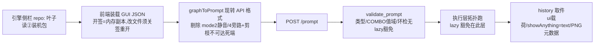

# 认知集(节点与工作流认知 §1-§4+工作流 JSON 章)
> 拆自 SKILL.md(1008 重组役);本文件为该域真源,冲突以真源地图三件为准

## 节点与工作流认知(1006 新章:节点详情·子图关系·设计纪律·文件关系)

> 本章收拢历役踩坑定谳(0922~1006;机制类=前端源码/活机实证,稳定;实据战役随条标注)。凡写/改节点、建/改子图、排查「改了没生效」先通读本章;与排查专文冲突时专文胜,回改本章。

### 1. 节点解剖(基础节点必知)

- 节点 JSON 字段:`id/type/pos/size/title/properties`+`inputs[]`(每项 `{name,type,link}`,widget 槽另有 `"widget"` 键)+`outputs[]`(每项 `{name,type,links[]}`)+`widgets_values`(按 widget 序装值)。**手建节点漏 `outputs[]`=双向一致性破**(实据:PrimitiveString 手建件);`widgets_values` 错位/缺占位=子图件多发实弹红根源(1002 F1)。
- **widget 输入 vs 连线输入**:同槽二选一,接线后 widget 成**摆设值**(面板值≠生效值),须 Note 注明或重构消灭。
- **links 三处挂接+死槽死线零容忍**:每条连线同挂 links 表+源 `outputs[].links`+目标 `inputs[].link`;`link.type` 必须=origin 槽实型(`"*"`≠STRING 会出事);节点删改后 link/边界槽/主图连线**不自动清**,架构改后全链审计(实据:五轮手术漏删 link330 被自检拦下;link303 陈旧指向=用户负向主体句静默丢弃)。
- **隐藏输入可回溯真实执行链**:`hidden:{"prompt":"PROMPT","unique_id":"UNIQUE_ID"}` 引擎执行期注入完整执行图;API 批量路径会剪枝路由节点、画布旁路件在 UI→API 转换期已剔除——披露/审计类需求走此路,勿读静态台账(先例 my_daojie_route [86],0922)。
- **OUTPUT_NODE 想看得见=ui 载荷+JS onExecuted**:裸元组返回前端不画(预览算了但看不见);py 侧回 `{"ui":{...},"result":...}`+web 扩展 `onExecuted` 回填显示框(前端版本可能传 `message.output.merged` 或 `message.merged`,**双形态兼容**);`WEB_DIRECTORY="./web"` 官方扩展点零改本体。刚打开不跑的两形态都属设计内:**有预填快照的件=打开即见快照**(部署时写进 JSON `widgets_values`,1006 展示框预填),**无预填的件=空框**;两者跑完一发都被 `onExecuted` 回填覆盖。**展示框持久化是双态设计(1007 用户令定谳)**:①短暂态 `serialize=false`(不进 widgets_values=不污染序列化,重启即空);②**持久态 `serialize=true` 文本随 widgets_values 落盘+载入预填,必须配 `onConfigure` 链守卫**(serialize=false 时代的旧存档缺本槽位,框架按位填充可能留 undefined,显式归 "";运行期仍由 onExecuted 覆盖)。实例=[401] 合并预览已转持久态(用户令「预览跨重启持久化」);同文件 api_key 密码控件的 serialize=false 是**密钥不落盘**设计,两者勿混。api 格式零波及:非 py 输入的 widget 不进 graphToPrompt,serialize 位只影响工作流文件 widgets_values。
- **multiline 文本框**:STRING 要渲染成占满节点的大文字框=`required`+`multiline:True`;**只读展示框必须放 optional**——required 会被 `/prompt` 验证层强求值直接 400(1006 实据)。展示框与控件的退役分界(删下拉框≠删展示框)见错题集 ERRORS.md「自研节点设计纪律」节。

### 2. 节点真实形状以 /object_info 为唯一真源

- **API 输入名≠画布显示名**(LoraLoaderModelOnly 真名 `lora_name`/`strength_model`,画布显示 `lora`/`strength`):读输入/写 API 图/造单测假图一律 `/object_info/<NodeType>` 实查 `input.required/input.optional/output`,禁凭画布记忆——单测假图必须按 object_info 形状造,否则假绿真弹全穿(0922 四连坑之首)。
- `/prompt` API **不吃 widget 默认值**(model/temp/max_tokens 必显式带,max_tokens 下限 256);裸 COMBO 槽写字面值会被空列表校验拒(value_not_in_list),须链接形态;easy showAnything 的 history 取值键=`text` 非 anything。
- **引擎验证层环检对 lazy 边不豁免**(`execution.validate_prompt`;执行层 graph.py 才豁免):A出B、B出A 的图 queuePrompt 直接拒——解法=拆件成链,不能靠 lazy 硬绕(1001 S8)。

### 3. 子图关系模型(宿主·定义·边界·主图,一处改处处查)

- 关系链:`definitions.subgraphs[]` 定义(内嵌 nodes/links/inputs/outputs)↔ 主图宿主节点(type+properties.subgraph=子图 uuid)↔ 宿主 `inputs[]`(与 sg.inputs 逐项镜像)↔ 主图 `links`(target_slot=宿主槽号)。**架构改后必跑六同步**(清单专文=排查文档 §五,两处须同款六项):①子图边界 inputs(槽名+槽号;含 `sg.inputNode(-10)` 元数据在场非空——缺/空=宿主零输入口)②宿主 host.inputs ③主图 links target_slot(**删中间槽后后续槽号整体移位,连线不跟=输入入口消失,最易漏**)④子图出口销位置=**虚拟出口节点(id=-20,SubgraphOutputNode)装载时按节点布局自动推导**(实测≈最右节点 pos.x+50 / 最顶节点 pos.y;1007 晚两会话双机实证),`outputs[].pos` 是被 `arrange()` 重算的**装饰字段,改它零视觉效果**(pos=4000 实验点不动实证;上会话 2450→2780 三修无效同因)——**调销位=调节点布局**:装配子图 [4014] y 204→340(带0 内),销盒底 208 与节点顶净距 132px,锚=契约 `test_subgraph_row_layout_top_to_bottom`(1007 深夜用户令再上移 y→80 顶带对齐:y 向净距防线就此退役——推导位横落 [4014] x 带与 y 无关,恒向右零重叠全权交 io-anchor enforcement;活机实证=轨 x 右缘+104px,带0 契约锚不变);**运行时执行器=`my_nodes/web/subgraph-io-anchor.js`**(1007 用户令「输出 port 须在输入 port 右侧且有距离」:看门狗 600ms 轻检,出口销 x 低于最右节点右缘+80 时锚定到下限,手拖更右不回拉;文件布局推导位必然内落,此扩展=恒向右/输出口最右铁律的落地 enforcement)⑤工作流三路热覆盖(仓库→装机 Resources→引擎缓存,见调用集 INVOCATION.md)⑥蓝图重同步(子图定义改后跑 sync,否则 blueprint-match 锚红)。
- **inputs[] 插条目=槽位后移连线错指(1008 实弹,上条六同步③「删中间槽」的 INSERT 方向镜像)**:节点 `inputs[]` 数组插入新条目→后续槽位号整体后移;子图 `links` 的 `target_slot`(对 outputs 则 `origin_slot`)按索引寻址→指向后移区的旧线全部错指到新槽名。实据:1008 给 i2i/edit 的 MyQi21PromptSelect 实例补「负面词直写/PE负面」两槽后 5 条连线错指(i2i link61/63/67、edit link12/19),被 PE 链 lazy 契约测试当场抓红。纪律:插条目必①按旧→新映射迁移连线槽号②全子图连线-槽名-类型一致性终验(槽型 `*` 通配豁免)③契约测试位序锚(inputs[N]/outputs[N]/名键索引表)随迁。配方:`apps/build/scripts/qi21_i2i_linkslot_fix_1008.py`(`REMAPPED` 旧槽→新槽映射+`coherence` 终验)。
- **层级与嵌套口径**:主图(=用户所说「父图」)→宿主节点→`definitions.subgraphs[]` 定义,三层各归各位;**本仓恒单层子图**(10-06 全库扫描 81 件 JSON:13 件含子图定义,子图内嵌子图节点 0 命中;契约文档无嵌套条款,layout_check scope 亦单层 `sub:<名>` 不递归)——未来若引入嵌套,六同步清单与 scope 模型两处口径须先扩再动手。
- **-10/-20=虚拟边界概念**:−10 只住 `sg.inputNode` 元数据字段(`{id:-10,bounding:[…]}`,驱动宿主输入口渲染),−20 只作出口边界;**禁塞进 sg.nodes 数组**(前端不认 `__subgraph_input__` 类型,报「请安装缺失的包」,1005)。
- **蓝图同步恒单向(蓝图→工作流)**:术后先「抽离回蓝图」再跑 sync,否则 sync 把手术打回旧版(1001);蓝图化宿主 type=前端新造实例 uuid(非定义原 uuid),幂等比较须除 id 归一;蓝图改后蓝图文件不同步=契约锚红。子图内新节点类型须重启引擎才注册(队列==0 硬门再重启)。

### 4. 宿主面板槽渲染(前端源码+活机定谳;排查专文=「子图宿主面板排查.md」)

- **宿主槽渲染成什么由子图内部落点决定,与宿主序列化无关**:边界线落点是带 widget 的输入(COMBO/BOOLEAN 等)→widget **提升**到宿主=面板控件;落点是 forceInput 纯槽→宿主渲染带名连线点(MODEL/CONDITIONING/LATENT 天然纯槽=带名)。修「面板不渲染/错名」先查内部落点声明(forceInput),勿再照序列化格式盲改(1005 ㊇翻案)。
- **终态公式**:STRING 连线槽=纯槽形(只 name/type/link;对象形+活 link 在连线后=裸点无标签+隐藏 widget 占位大空白);widget 槽=对象形 `"widget":{"name":"槽名"}`(布尔 `true` 无效);`widgets_values` 只装 widget 槽值。
- **序列化零重叠≠视觉零重叠**:multiline 展示框把实际渲染撑大于序列化 size——间距按渲染后占位留,画布门加活机截图复核(est/自查仍按序列化口径,见优化集 OPTIMIZATION.md ②)。

## 工作流 JSON 配置与逻辑(逐字段+执行链,1006 扩写)

> 字段名与取值口径取自本仓生产件实况(逐字段核对过 qi21-道劫-t2i.json,2026-10-06),非凭记忆;与前端新版序列化行为冲突时,以图内 `extra.frontendVersion` 对应版本行为为准并回改本节。

### 术语对照与区分口径(先读:用户问法→JSON 字段)

- **node=节点**:`nodes[]` 一项;宿主节点 type 位=子图 uuid。
- **宿主(host)=主图里代表子图的节点**:type=子图 uuid、`properties.subgraph`=同 uuid;子图机构本体住 `definitions.subgraphs[]`——画布上的子图块=宿主,双击进入的才是定义(逐字段见「子图定义」节)。
- **父图=主图(顶层图)**:用户说「父图」即主图,JSON 无「父图」字面字段;层级链=主图→宿主→子图定义,本仓恒单层(嵌套口径见本件 §3)。
- **slot=槽,port=端口**:一物两面——JSON 里 `inputs[]`/`outputs[]` 一项=slot,画布上渲染的圆点=port;**port 的标题=slot 的 `name` 字段**。
- **link=连线(输入线)**:`links[]` 一条记录,一条线三处挂接(links 表+源输出槽 `links`+目标输入槽 `link`)。
- **连接参数=一条线登记了什么**:顶层 `links[]` 数组形六元组 `[link_id,src_node,src_slot,dst_node,dst_slot,type]`;子图内对象形 `{id,origin_id,origin_slot,target_id,target_slot,type}`——两制勿混,逐字段见「子图定义」;槽号 0 起算按位索引,读法示例见下「三个号码域」。
- **rail=边界轨**:子图 `sg.inputs`/`sg.outputs` 边界槽表,子图内部连线以 `-10`/`-20` 指向它们。
- **三个号码域不混**:节点 id / 线 id(`link_id`)/ 槽序号(`src_slot`/`dst_slot`,0 起算,**按位索引** `outputs[]`/`inputs[]`)。读法示例:`links` 项 `[218,404,0,6,2,"STRING"]`=「404 的输出槽 0 → 6 的输入槽 2,这条线编号 218」。
- **进出不对称**:输入槽 `link` 是**单值**(最多一条进线,再接=顶替);输出槽 `links` 是**数组**(一出扇出多家)。拆一条线动三处,给一个输出加消费者只动源 `outputs` 一处。
- **同名不同物五例**:节点 `title`≠端口 `name`;端口显示名≠API 输入名(`/object_info` 为准,见认知章 §2);顶层 links 数组形≠子图 links 对象形;输出 **port**≠输出**节点**(OUTPUT_NODE=执行图取件端);**下拉框(控件)≠展示框(只读展示)**——同住 `widgets_values` 的两种物:控件参与计算可退役;展示框 JS 回填只展示,退役类指令默认不及(判例与流程见错题集 ERRORS.md「自研节点设计纪律」节)。
- **连接状态=某槽接没接线、接线后值归谁**:输入槽看 `link`(null=未接=widget 字面值生效;有值=已接成线),输出槽看 `links[]`(空=暂无消费者);形态细则=下条「widget 槽三态」,删改后的残线/死线纪律=本件 §1「三处挂接」。
- **widget 槽三态**:`link:null`+widget 在场=字面值生效;`link` 有值+widget 在场=摆设值(面板值≠生效值);宿主提升槽=面板控件(实例值权威=宿主 `widgets_values`,定义级 `sg.widgets` 只是出生缺省)。
- **「输入输出」三层各归各**:①节点槽级(输入/输出 port)②子图边界轨级(`sg.inputs`/`sg.outputs`,-10/-20)③输出节点级(OUTPUT_NODE;graphToPrompt 只保留可达输出节点的子图,见「执行链」)。

**两种格式,何时写哪种**:

- **GUI 格式**(画布加载与「保存」产出):顶层 `nodes`+`links`+`groups`+`definitions`(子图)+发号器+视图状态;写它=给人打开看(桥/引擎侧栏)。本仓生产件真源=GUI 格式(生成器产出,引擎侧栏以 `repo:` id 只读合并消费)。
- **API 格式**(`/prompt` 运行):`{ "<节点id>": { "class_type", "inputs" } }`;写它=headless 跑。**它不是第二份手写真源,是前端 `graphToPrompt` 从 GUI 现转的产物**(转换逻辑见「执行链」);手建图双格式都写(GUI 给画布/桥看,API 给 `/prompt` headless 跑——此纪律出自 comfyui 技能)。

### GUI 格式逐字段(配置层)

顶层字段:

| 字段 | 含义与逻辑 |
| --- | --- |
| `id` | 工作流 uuid(前端标识侧栏/标签) |
| `revision` | 修订计数(前端维护;手写保持现值勿乱动) |
| `last_node_id` / `last_link_id` | **发号器高水位**(新建节点/连线取 next id):手写图必须 ≥ 图内现有最大 id,否则前端新建即撞号 |
| `nodes[]` | 节点表(逐字段见下表) |
| `links[]` | 连线表,每项 `[link_id, src_node, src_slot, dst_node, dst_slot, type]`(数组形六元组按位);节点 `inputs[].link`/`outputs[].links` 挂接这些 id |
| `groups[]` | 组框 `{id,title,bounding:[x,y,w,h],color,flags}`;组框文案住 `title`(画布横幅),非 Note |
| `definitions.subgraphs[]` | 子图定义表(见下小节);无子图的图可整键缺席 |
| `extra` | 前端杂项:`frontendVersion`(序列化格式以其为准)/`ds`(画布视图 scale+offset,保存视口)/插件块 |
| `extensions` | 前端扩展持久化块(如 `seed_widgets`,其内容另在顶层 `seed_widgets` 键双写=前端行为,内容同) |
| `config` / `version` | 图级配置(现恒空)/LiteGraph schema 版本(0.4) |

节点对象(`nodes[]` 每项):

| 字段 | 含义与逻辑 |
| --- | --- |
| `id` | 图内唯一正整数;API 格式以此为键 |
| `type` | 节点类名(须引擎已注册,`/object_info` 可查);**宿主节点此位=子图 uuid** |
| `pos` / `size` | `[x,y]` 浮点画布坐标 / `[w,h]` 渲染尺寸(est 判据原料);老前端(≤1.51.x)偶把二者写成字符串键 dict `{"0":x,"1":y}`(1008 社区件实据,MarkdownNote),读方工具两形兼容 |
| `flags` | 节点旗标(如折叠);常态 `{}` |
| `order` | 前端绘制/保存序,**≠执行序**(执行序运行时按拓扑现定,改它不改执行) |
| `mode` | `0`=常规;`2`=静音、`4`=旁路——两者都进不了执行图(见执行链) |
| `inputs[]` | 输入槽 `{name,type,link}`;widget 槽=同名加对象形 `"widget":{"name":槽名}` 且 `link:null`;**连线纯槽形只 name/type/link 三键**(形态语义见本件 §4) |
| `outputs[]` | 输出槽 `{name,type,links:[link_id…]}`;手建节点漏此键=双向一致性破 |
| `widgets_values` | 按 widget 声明序装值;**宿主只装 widget 槽值**(序=面板控件序);错位/缺占位=实弹红根源(F1 七值形头部空串占位) |
| `widgets_values_named` | 按名寻址镜像(前端 1.53+ 双写);对拍/幂等比较两表都要认 |
| `title` | 画布显示名(规范见优化集 OPTIMIZATION.md ⑧2;缺省=类名) |
| `properties` | `{"Node name for S&R": 真类名}`(搜索替换/渲染锚);宿主另有 `"subgraph": uuid` |

- 双槽复活判例(1008)已迁错题集 ERRORS.md。

子图定义(`definitions.subgraphs[]` 每项;契约真源=`docs/comfyui-kb/子图工作流工程契约.md`(linkIds 登记/装载稳定序/收装惯例)+comfyui 技能 Subgraphs 章+契约测试):

- 标量:`id`(uuid;宿主 type 指它)/`name`/`version`(子图 schema 版,现 1)/`revision`/`last_link_id`。
- `state`:前端计数器(lastGroupId/lastNodeId/lastLinkId/lastRerouteId),机器域勿手编。
- `inputs[]`/`outputs[]`:边界槽 `{id:uuid, name, type, linkIds:[…], pos:[x,y]}`——pos=边界槽在子图画布的坐标(输出口最右判据以它为端点;出口 pos 必须与最右节点紧邻,见优化集 OPTIMIZATION.md ④/本件 §3)。
- `links[]`:**对象形** `{id, origin_id, origin_slot, target_id, target_slot, type}`(与顶层数组形是两制,勿混写);`origin_id=-10` 取自 `inputs[origin_slot]`、`target_id=-20` 送到 `outputs[target_slot]`(来历见优化集 OPTIMIZATION.md ④)。
- `inputNode`/`outputNode`:`{id:-10/-20, bounding:[…]}` 元数据(驱动宿主口渲染);**±10/±20 禁入 `nodes[]`**(本件 §3)。
- `widgets`:定义级 widget 缺省快照(新实例出生缺省);**实例运行值权威=宿主 `widgets_values`**,读值以宿主为准。
- **宿主节点(主图侧)**:主图以一个普通节点代表子图,外部经宿主输入/输出槽接线;`inputs[]` 与 `sg.inputs` 逐项镜像(连线槽=纯三键+活 link,widget 槽=对象形+`link:null`)。实况样例(生产件宿主 [6]):inputs=[正向主体句(纯槽,link15)/型选择(COMBO+widget 对象,link:null)/负向主体句(纯槽,link218)],widgets_values=["人物"]。
- 布局:layout_check 对顶层与每个子图分 scope 独立跑全套判据(scope 名 `sub:<子图名>`)。

### API 格式与连线类型机制

- API 每输入=字面值**或** `["<源节点id>", <输出槽序号>]` 二项引用(槽号=源节点匹配输出的 index,0 起算)。
- **类型必须匹配**(IMAGE/LATENT/MODEL/CLIP/VAE/CONDITIONING/MASK/CONTROL_NET…);缝上类型不同就插转换件:`VAEEncode`(IMAGE→LATENT)、`VAEDecode`(LATENT→IMAGE)、`CLIPTextEncode`(text→CONDITIONING)、`ImageScale`(尺寸)。绝不 IMAGE 直塞 LATENT 输入。
- 节点真实输入输出以 `/object_info/<NodeType>` 实查(`input.required`/`input.optional`/`output`),不猜;API 输入名≠画布显示名(本件 §2)。

### 执行链(GUI JSON 怎么变成一次跑图;逻辑层)

- 转换期副作用(披露/审计类的坑):**画布上有什么≠执行图里有什么**——mode 2/4 件与不可达死端在 `graphToPrompt` 就消失(子图内死端被剪枝实据 1002);审计真实加载链走 hidden PROMPT 注入回溯(本件 §1),勿数画布。
- 验证层环检对 lazy 边不豁免、执行层才豁免(本件 §2);`/prompt` 不吃 widget 默认值,COMBO 字面值过不了值域校验。
- history 取件键随节点而异(easy showAnything=`text`;自研 OUTPUT_NODE=ui 载荷键);PNG 元数据=提示词三层收据之一。
