# json/ —— 道劫提示词资产唯一真源家

**家规:道劫风格的机读供给资产只住本目录,只有一份。**别处出现的同名文件一律是分发产物或历史记录。

**MA 绑定铁律(1005 用户令:跨仓引用一律相对路径)**:本风格已与 MA 项目绑定(MA 侧家=`skills/art_skills/daojie_ink_guofeng/`,其 `ma_sync/`=同步契约快照)。**两仓任何文件互相引用只写各自仓内相对路径**(如 MYStudio `apps/frontend/assets/studio-manuals/art_skills/daojie_ink_guofeng/json/`、MA `scripts/data/三轨选色配料.toml`),**禁 `/Users/...` 绝对路径**——MA 已历 Unity/MA→IP/MA 迁移,绝对路径即断的实证;仓位注入走参数/环境变量(`--ma-root`/`--repo-root`/`MA_IMAGEGEN_ROOT`/`MYSTUDIO_APPS_ROOT`),不落默认绝对值。色卡正典=`../ma_sync/palette-canon.json`(本仓相对,双侧 sha 一致)。

> **统一规范宣言(10-04 用户令)**:本目录是「每个美术风格类型一个 json/ 唯一资产家」规范的**第一个实验**(1005 勘正:色卡正典不住本家——住 ../ma_sync/palette-canon.json,带 MA 同步守护与生产消费方;前晚转制的两件冗余色卡已退役)——道劫打样,未来各美术风格目录均照此模式建 `json/` 家。家的边界=**美术风格**,不分 K2/Q2.1 产线(LoRA 栈等风格资产同住)。

## 命名登记表(1008 R 批命名统一令:一个概念全链一个名字)

| 概念(中文名) | 唯一机读键 | 画布/文档显示名 | 备注 |
|---|---|---|---|
| 美术风格底座 | `art_style_base` | 美术风格底座 | 1008 R 批由 `lock_layer` 原子改名;旧术语 锁层A/③通用锁层/常量A 就地退役(历史台账留史不改) |
| 类型句(型底座) | `types[]` | 底座十选一 | 每型以 `zh` 为唯一选型键;旧冗余 `key` 字段 1008 R 批删除(九型 key≡zh 同值) |
| 主体句 | (无 json 键,每图手写) | 正向提示词 | 资产住 docs/prompts/道劫_九型主体句示例.md |
| 扩写指令 | `expand_instruction` | [4030] 系统提示词 | 教材原文永不删改(08§11) |
| 分层契约 | `layer_contract`(内联)/`prompt_layering.json`(完整版) | — | 两者由设计互锁 |
| MyQi21PromptAssembly 的画风底座参数槽 | —(节点输入名) | 锁层A全文 | **显示名类=翻译非标识符,暂保留**([4011] i2i 在档实例+蓝图+同步锚同名人肉耦合,更名属接口改造,候后续收敛批) |

> 登记表即权威:其余多名概念(型底座/类型句等)按同一铁律逐步收敛,以本表为准。

## 字段字典(用户可读性三件套之二,1008 用户令)

约定:**下划线前缀键(如 `_doc`/`_doc_types`)=注释键,程序永不读取**;改任何字段前先读下行,改后跑契约测试。

### qi21_bases.json 顶层 7 节

| 节 | 中文名 | 职责 | 消费方 | 改了会怎样 |
|---|---|---|---|---|
| `art_style_base` | 美术风格底座 | 全十档恒挂的画风锁(画种/线条/罩染/表面工艺/平光契约)+全局负面词 | 底座/装配/API扩写/真源文本预览四类节点,t2i/i2i 工作流,契约测试 | 每张道劫图的画风与全局负面即时随变(节点 mtime 热读);测试 sha 锚须同批重锚 |
| `rgba` | RGBA透明包裹句 | 透明路头尾句(中英)与W1收束句 | 最终输出/选择器件;i2i/edit 英文路(`head_en`/`tail_en` **现役消费勿清**) | 透明型成图的包裹文字变化;英文头尾影响 i2i/edit 英文路 |
| `expand_instruction` | 扩写指令 | AI 扩写的系统提示词教材(八步宪法原文)+语言规则替换表 | API扩写节点(送模型)、真源文本预览;ChinesePE(休眠件) | 模型扩写行为随变;教材=宪法原文,改动走 08§8 八步 SOP+[4030] 双刷 |
| `strip_lexicon` | 清筛词表 | PE 出文的词族剥离正则(en/zh/大小写不敏感) | 最终文本合成器(透明路剥离) | 透明路保留哪些词族随之变 |
| `types` | 类型句(十档) | 九型+自由的型底座:见下字段表 | 底座十选一/API扩写/LoRA/画幅/透明默认各节点 | 换型即换构图格式锁/画幅/型级正负;`recipe_version` 标签只在对应型终审后才刷 |
| `layer_contract` | 分层契约(内联) | 八段公式×三层职责分配的引擎侧精简版 | 契约测试/装配语义参照 | 三层职责裁决随之变;完整版 prompt_layering.json 须同笔互锁 |
| `color_lexicon` | 色卡词典 | 在用词↔MA编号+hex 映射/五职责/冲突裁决序 | API扩写(色卡上下文)、真源文本预览[4031] | 模型可选色与主体句色锚纪律随变;**hex 禁入任何 prompt 正文** |

### types[] 字段逐个(1008 R 批删除冗余 `key` 后=13 字段;「自由」型仅持有前 7)

| 字段 | 中文释义 |
|---|---|
| `zh` | 型名(中文)——下拉显示与**唯一选型键**;十档顺序=使用序 |
| `aspect_ratio` | 画幅档——官方 ResolutionSelector 枚举值(如 `3:4 (Portrait Standard)`),缺档回退 1:1 |
| `megapixels` | 百万像素档——分辨率基数(如 4.2),与画幅档合算出宽高 |
| `rgba_default` | 透明默认——该型默认是否走 RGBA 透明路(道具/多视图/高清人脸/表情差分四型 true) |
| `negative_text` | 型级负面词——本型专属缺陷词清单,与美术风格底座负面、主体句负面三源合并 |
| `positive_text` | 型级正向——构图格式锁/环境画法/风格应用句/光强度档/多彩行(「自由」型恒空串) |
| `purpose` | 用途契约——向主体句「下单」的说明(写什么/写到什么精度;占位元语言,不入提示词正文) |
| `recipe_version` | 配方版本标签——**对应型提示词完成静态+实弹验收后才刷**,禁止先改标签制造已终审假象 |
| `lora_recipe` | 按型 LoRA 配方——[{file,weight,slot}] 列表(K2 承接字段,Q2.1 线不用) |
| `steps_hint` | 步数档——{fast,quality} 两档建议步数 |
| `i2i_routes` | 图生图路由——该型出图后可走的高清精修线清单(K2 承接字段) |
| `postprocess` | 后处理说明——出图后的加工链文字说明(K2 承接字段) |
| `color_recipe` | 多彩行预算——{base,ink,stable[],mid[],accent[]} 五职责色词份数制,冲突按 color_lexicon.conflict_order 裁决 |

> 旧 `key` 字段=与 `zh` 同值的冗余双键,1008 R 批删除;唯一消费方(底座节点选型)已改单读 `zh`。

## 用户读图(先看什么)

```mermaid
graph TB
    subgraph qi21_bases.json["qi21_bases.json(真源)"]
        A["art_style_base 美术风格底座<br/>(全图恒挂:画怎么画)"] --- B["types[] 类型句十档<br/>(选型定:图怎么构)"]
        B --- C["expand_instruction 扩写指令<br/>(AI 怎么炼)"]
    end
    subgraph 每张图
        S["主体句(每图手写:画什么)"]
    end
    A --> P["装配全文 = 主体句↵类型句↵美术风格底座"]
    B --> P
    S --> P
    P --> E["[4013] AI扩写(润炼) → 最终输出 → 编码"]
    A -.->|"负面"| NEG["负向 = 底座负面+型负面+主体句负面<br/>(三源程序合并,模型不碰)"]
```

**阅读顺序**:①本表(家规+命名登记表)→②打开 `qi21_bases.json` 先看各节 `_doc` 注释键→③要改某字段查上方字段字典「改了会怎样」→④改前复制副本,改后跑契约测试,过对比报告才算完成。三层职责边界(谁写什么)详见 `prompt_layering.json`(完整版契约)。

| 文件 | 角色 |
|---|---|
| `qi21_bases.json` | **生产真源**:美术风格底座(art_style_base)/九型+自由=10 条底座(types)/PE扩写指令/清筛词表/分层契约(layer_contract)/色卡词典(color_lexicon);types[] 每型含 K2 承接字段:lora_recipe/steps_hint/i2i_routes/postprocess/recipe_version(数据实存,配方矩阵文档为其投影) |
| `qi21_strip_lexicon.json` | Q2.1 清筛正则表(pattern;与 qi21_bases 内嵌 strip_lexicon 词表并存,非重复;留档件) |
| `daojie_lora_stack.json` | K2 LoRA 栈序(14条) |
| `daojie_loras.json` | K2 LoRA 台账(9条) |
| `prompt_layering.json` | 分层契约完整版(手册版;layer_contract 为其内联精简版,二者由设计互锁) |

## 不收项边界(1004 穷尽核验轮,防再问漏没漏)

MA `美术风格提炼/` 目录中**未收编**的部分及理由:md 方法论文档×6(选色决策实战卡/宋代审美提炼/装配规范/阵营md/中国式原始提示词208KB案例集/索引)——文档层按裁定住 docs/prompts 参考;`manifest.json`(290KB 上游素材溯源器,管的是 md 素材的来源哈希,不涉色卡数据);`licenses/`(整包许可文件,要点已在两 JSON 的 _meta 注记);`images/` 90+ 素材图。色卡机读资产=两个 toml 的全部内容,已 100% 转制(递归键 diff 零差)。

## 分发与同步(1008 勘误:旧口径已废止)

> 旧口径勘误:~~引擎侧 `my_nodes/nodes/` 下四个同名 JSON=同步产物,由 `daojie_prompt_source_sync.py` 从本家单向复制,契约测试 `test_prompt_source_single_truth` 锁逐字节一致~~——①`my_nodes/nodes/` 已**零 JSON**(四件 1005 Step4 已删,1008 复核实测);②`daojie_prompt_source_sync.py` 已标 `[RETIRED 1005 Step4]` **留档勿运行**;③`test_prompt_source_single_truth` 已不存在。

现行机制(1008 核实定谳):

- **引擎家自播种(幂等)**:引擎家 `<comfy-home>/daojie-data/` 四件(qi21_bases/qi21_strip_lexicon/daojie_lora_stack/daojie_loras)由 `plugin_manager.sync_daojie_data()` 三段式自播种——种子家(本目录)sha256 校验、幂等、防漂移,契约测试 `test_daojie_data_sync` 锁定。
- **热修=五路同刷**:改真源后,同批刷 真源(本目录)→ 构建产物(`apps/release/build/…/studio-manuals/…`)→ 装机(`/Applications/漫影工作室.app/Contents/Resources/studio-manuals/…`)→ 引擎家 `daojie-data/` → MA 镜像(`IP/MA/skills/art_skills/daojie_ink_guofeng/json/`),五处 md5 同一才算同步。**禁手改任何分发副本。**
- `ma_sync/`(本目录旁)三快照已声明漂移,归 MA 同步役,勿顺手对齐。

## 修改流程(1008 勘误)

改真源(本目录 json,splice 脚本手术+锚断言,禁手改 json)→ 改前副本+改后字段级对比报告(任务档 backups/)→ 契约测试回归绿(`npm --prefix apps run test:py -- --domain my_nodes` / `engines`)→ 五路同刷(上节)→ 涉节点 .py 变更时引擎重启(队列==0 门)→ 改后五树指纹复扫=终验。~~跑 daojie_prompt_source_sync.py~~(已 retired)。
