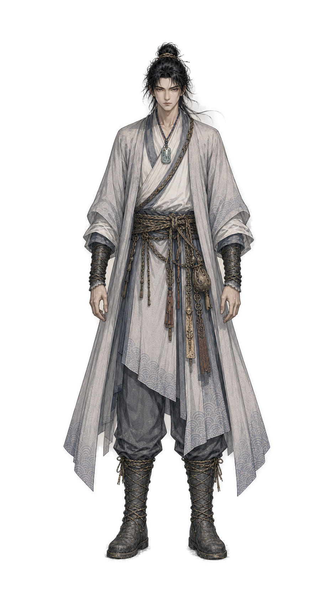

<div align="center">


# MYStudio · 漫影工作室

**A local-first AI workbench for animated dramas and short films**

From novel to final cut — scripts, storyboards, assets, voice-over, and editing in one traceable workflow.

<p>
  
  
  
  
</p>

[简体中文](../README.md) · [English](./README.en.md) · [Commercial License](../COMMERCIAL_LICENSE.md)

</div>

---

## Overview

MYStudio is a desktop production tool for AI-driven animated series, short dramas, and novel-to-film adaptation. It brings long-text adaptation, screenplay editing, character and scene assets, storyboard production, video candidate generation, local editing/compositing, and project configuration together into a single, traceable workflow.

The project emphasizes a local-first approach with creator control: assets, project data, and generation records are stored on the user's machine first; AI output enters the project as drafts, candidates, and editable data rather than overwriting final content directly; local video compositing is done via FFmpeg, making it easy to quickly produce previewable, reviewable, and re-editable clips and final cuts on the desktop.

### Core Positioning

- A unified workbench for novel adaptation, AI animated drama, short-drama storyboarding, and local final cuts.
- A structured workflow that carries the full production process from text to video.
- Project-level storage for source text, scripts, storyboards, assets, candidate videos, and configuration.
- Local FFmpeg support for turning image/video assets into candidate clips and stitching full episodes.
- A configuration center for managing models, provider capabilities, and per-task model bindings.

### Production Pipeline

The core pipeline is:

```text
Novel/Script Import -> Skill Context -> Script Draft -> Storyboard -> Production Track -> Candidate Clips -> Editing/Compositing -> Config Validation
```

The pipeline supports phased progress: you can stop at scripts and storyboards, or continue to bind assets, generate candidate clips, and produce a full video via local compositing. Each stage keeps a manual revision entry point, so creators retain control when AI output quality is unstable.

### Architecture

- Desktop app: runs on Electron, suited for managing local assets, calling native capabilities, and exporting files.
- Frontend workbench: built with React and TypeScript.
- State management: Zustand manages project workflow, assets, storyboards, candidates, and configuration state.
- File-based storage: aimed at personal creative projects, reducing database deployment and backend maintenance cost.
- Local compositing: the Electron main process invokes FFmpeg for candidate clip rendering, subtitle burn-in, and stitched output.

### Design Goals

- Maintain clear reference relationships among novels, scripts, storyboards, assets, and video candidates.
- Make AI output reviewable, revertible, and replaceable rather than a one-shot black box.
- Progressively structure the characters, scenes, voices, subtitles, and shot states needed for short-drama production.
- Let casual users complete a final cut by following the workflow, while advanced users dive into finer storyboard, editing, and configuration steps.
- Keep current project data intact when later extending to TTS, subtitle styling, multi-track export, and Agent/Skill orchestration.

## Built-in Art Styles

**60 built-in** art styles covering 2D animation, 3D rendering, stop-motion, and live-action imagery — applied with one click during storyboard production.

<table>
  <tr>
    <td align="center" width="25%"><br/><sub><b>2D Hand-drawn</b></sub></td>
    <td align="center" width="25%"><br/><sub><b>Ink Guofeng</b></sub></td>
    <td align="center" width="25%"><br/><sub><b>Clay Stop-motion</b></sub></td>
    <td align="center" width="25%"><br/><sub><b>Live-action Wuxia</b></sub></td>
  </tr>
</table>

👉 [Browse all 60 art styles →](./art-styles.en.md)

## Entry Points

After opening a project, open `Workflow` on the left:

1. `Novel`: import `.txt/.md` or paste the body text.
2. `Skill`: generate a context bundle and save manual work data.
3. `Script`: save the screenplay draft.
4. `Storyboard`: maintain tracks, durations, asset paths, and dialogue.
5. `Editing`: generate candidate clips with local FFmpeg, then stitch the selected ones into a final cut.
6. `Config`: save relay endpoints, model definitions, and task bindings.

## License

This project uses a dual-licensing model:

- The community edition is released under the [GNU Affero General Public License v3.0](../LICENSE) (AGPL-3.0) by default.
- If you modify or distribute this project, or provide a service to network users based on it, you must comply with AGPL-3.0 requirements such as open-sourcing and retaining copyright notices.
- If you want to integrate this project into a closed-source commercial product, closed-source SaaS, or a commercial scenario where modifications are not disclosed, you need a commercial license.

For commercial licensing, closed-source use, and enterprise support, see [COMMERCIAL_LICENSE.md](../COMMERCIAL_LICENSE.md).

## Minimum System Requirements

The project's AI features (TTS voice cloning, speech recognition, image/video generation, etc.) rely on local model inference and **require a dedicated GPU**. Integrated graphics cannot meet the compute requirements.

### macOS (Apple Silicon)

| Item | Minimum | Recommended |
|------|---------|-------------|
| Chip | **Apple Silicon M1** (built-in GPU) | M2 Pro / M3 or higher |
| OS | macOS 13 Ventura | macOS 14 Sonoma+ |
| Unified Memory | 16 GB | 32 GB+ |
| Disk | 20 GB free | 50 GB+ SSD |

> ⚠️ **Intel-based Macs are not supported** (no MLX GPU acceleration).

### Windows

| Item | Minimum | Recommended |
|------|---------|-------------|
| OS | Windows 10 64-bit | Windows 11 |
| GPU | **NVIDIA dedicated GPU, 8 GB VRAM** (CUDA-capable) | NVIDIA RTX series, 16 GB+ VRAM |
| RAM | 16 GB | 32 GB+ |
| Disk | 20 GB free | 50 GB+ SSD |

> ⚠️ **An NVIDIA dedicated GPU is required.** Integrated graphics (Intel UHD / AMD iGPU) and non-CUDA GPUs cannot run local AI inference.

### Common

- Node.js >= 18 (latest LTS recommended)
- Python 3.12 (bundled with the project, no manual install needed)

## Development Setup

### Prerequisites

- Node.js >= 18
- macOS (Apple Silicon) / Windows 10+ (NVIDIA GPU) / Linux x86_64

### One-Click Setup

**macOS / Linux:**

```bash
git clone https://github.com/xinzhuzi/MYStudio.git
cd MYStudio
bash apps/build/setup.sh
```

**Windows (PowerShell):**

```powershell
git clone https://github.com/xinzhuzi/MYStudio.git
cd MYStudio
powershell -ExecutionPolicy Bypass -File apps\build\setup-win.ps1
```

The script automatically:
1. Downloads Python 3.12 (python-build-standalone, project-local, does not affect the system)
2. Installs Python backend dependencies (MLX on macOS; CUDA PyTorch + qwen-tts on Windows)
3. Installs Node.js dependencies

### Run

```bash
cd apps && npm run dev
```

### Build

```bash
# macOS
cd apps && npm run build:mac
# Windows
cd apps && npm run build:win
```
