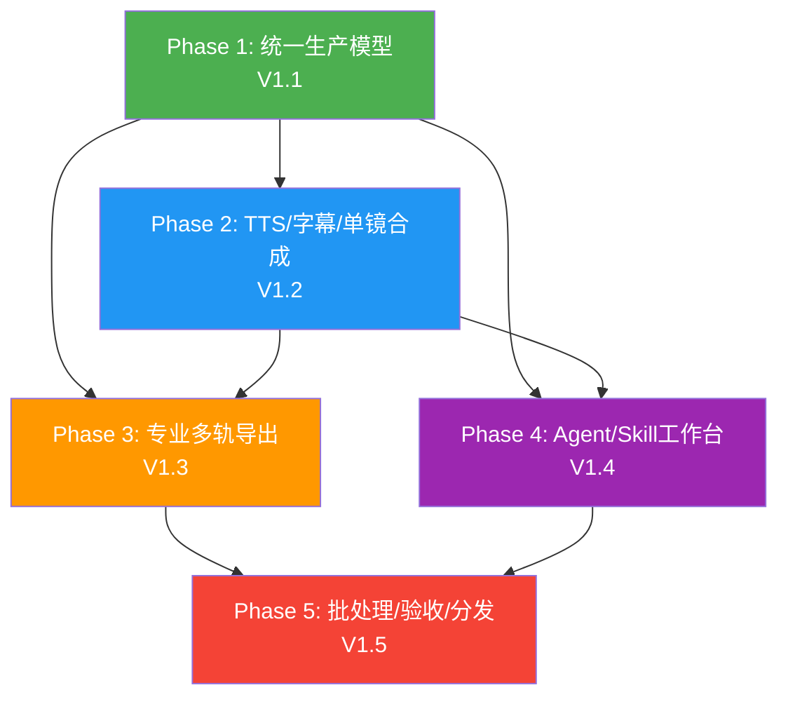
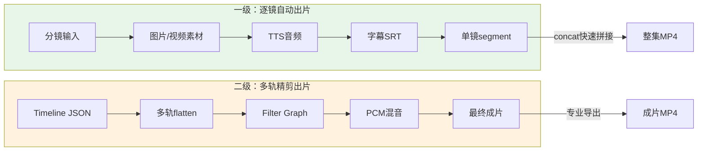
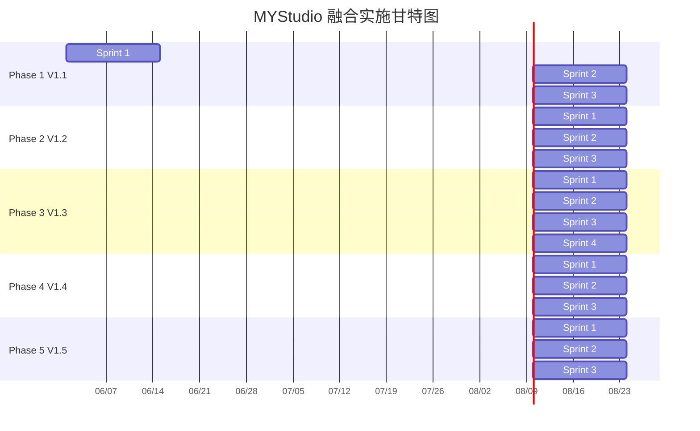
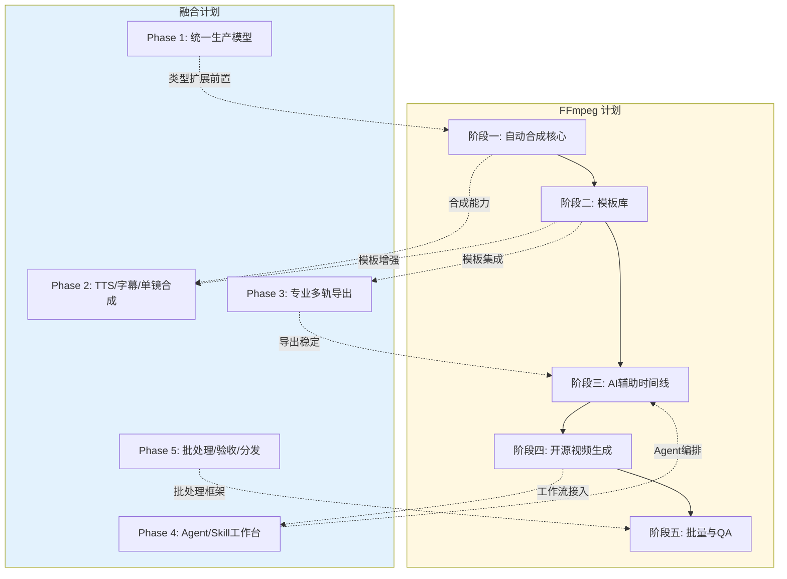
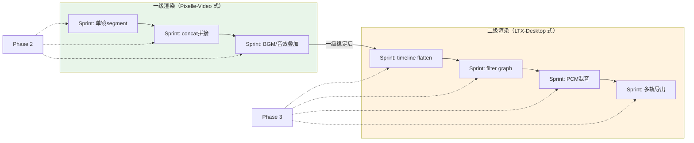
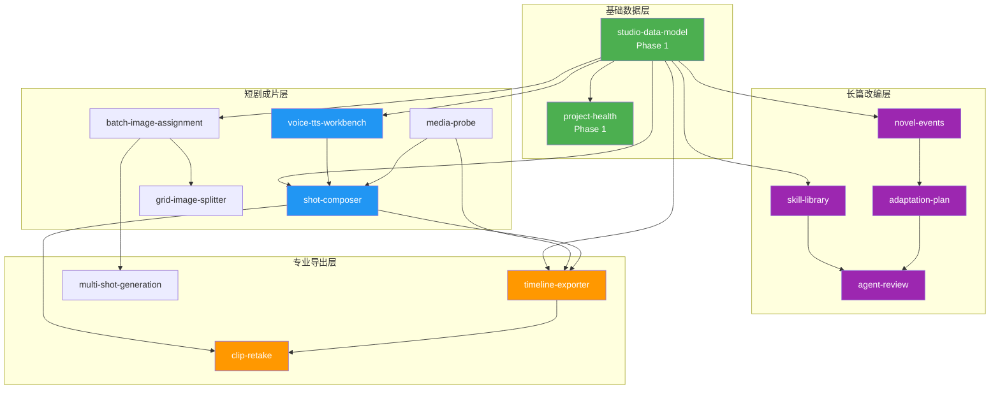
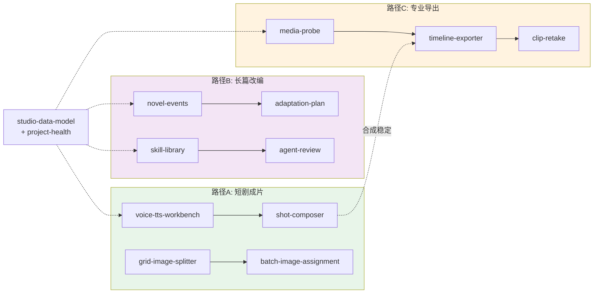

# 实施里程碑与依赖手册

> 本文档为《MYStudio四项目融合总计划》和《FFmpeg+AI开源漫剧短视频自动化计划》的配套执行手册。目标读者为项目管理和全体开发人员，提供五阶段实施的时间线、依赖关系、Sprint拆分、验收标准和资源预算。

---

## 1. 总体里程碑时间线

### 1.1 五阶段与版本对应关系

| Phase | 版本 | 名称 | 核心目标 | 预估周期 |
|-------|------|------|---------|---------|
| Phase 1 | V1.1 | 统一生产模型 | 扩展 StoryboardItem / ProductionTrack 类型，建立分镜字段编辑 UI，旧数据兼容 | 6-8 周 |
| Phase 2 | V1.2 | TTS/字幕/单镜合成 | 角色音色绑定、TTS 生成、字幕样式升级、单镜合成（视频+TTS+字幕） | 6-8 周 |
| Phase 3 | V1.3 | 专业多轨导出 | FFmpeg 模块拆分、timeline flatten、filter graph、PCM 混音、导出取消 | 8-12 周 |
| Phase 4 | V1.4 | Agent/Skill 工作台 | Skill 文件化管理、三层 Agent 工作数据、供应商能力面板、前置阻断 | 6-8 周 |
| Phase 5 | V1.5 | 批处理/验收/分发 | 统一任务状态、Demo 项目、端到端验收、打包前 FFmpeg 检测 | 6-8 周 |

### 1.2 版本交付节奏

```text
V1.1 ─── V1.2 ─── V1.3 ─── V1.4 ─── V1.5
 │         │         │         │         │
 │         │         │         │         └─ 批量生产与QA
 │         │         │         └─────────── Agent/Skill编排
 │         │         └───────────────────── 专业多轨导出
 │         └─────────────────────────────── TTS/字幕/单镜
 └───────────────────────────────────────── 统一生产模型
```

### 1.3 里程碑依赖原则

- Phase 1 是所有后续 Phase 的前置：统一数据模型后，TTS、导出、Agent 才有稳定字段可用。
- Phase 2 依赖 Phase 1 的 StoryboardItem 扩展：没有结构化对白、角色、字幕字段，合成只能继续猜字符串。
- Phase 3 依赖 Phase 1 的 export 子模块拆分和 Phase 2 的合成链路验证：FFmpeg 工程化需要先有可用的单镜合成基础。
- Phase 4 依赖 Phase 1 数据模型和 Phase 2 生成链路：Agent 需要结构化输入和可追踪的生成结果。
- Phase 5 依赖全部前序 Phase：批处理和端到端验收需要完整的单镜合成和多轨导出能力。

---

## 2. 关键路径可视化

### 2.1 Phase 依赖关系图



### 2.2 FFmpeg 两级渲染路径



### 2.3 关键路径甘特图



---

## 3. Phase 1-5 详细内容

### 3.1 Phase 1: 统一生产模型 (V1.1)

**前置条件：**

- MYStudio 当前代码可正常 `npm run dev` 启动。
- `src/types/studio.ts` 和 `src/stores/studio-store.ts` 处于可编辑状态。
- 已通读融合总计划第 5 节类型规划和第 16 节源码核验。

#### Sprint 1: 扩展 studio.ts 类型和 store 默认值（2 周）

| 周次 | 交付物 | 验收标准 |
|------|--------|---------|
| W1 | `StoryboardItem` 新增镜头字段、提示词字段、绑定字段、音频字段、字幕字段（全部可选） | TypeScript 编译通过，旧分镜对象默认值完整不报错 |
| W1 | `CharacterProfile` 基础类型定义：name、aliases、appearance、voiceId、referenceAssetIds | 类型可被 store 引用 |
| W2 | `studio-store.ts` 新增角色/场景/资产 action 和默认值 | `addCharacter`/`updateCharacter`/`addScene`/`updateScene` 可持久化 |
| W2 | `AssetReference` 统一素材引用类型 | 图片/视频/音频素材统一走 AssetReference |

**风险点与缓解：**

| 风险 | 缓解措施 |
|------|---------|
| 新字段导致旧项目加载失败 | 所有新字段设为可选，store merge 时补默认值 |
| store 膨胀影响性能 | 角色/场景/资产按需加载，不全量放入主 store |
| 类型定义与 Huobao schema 对不上 | 先以 Huobao schema 为蓝本，逐字段映射到 MYStudio 命名规范 |

#### Sprint 2: 分镜详情 UI 字段组 + 旧数据兼容（2 周）

| 周次 | 交付物 | 验收标准 |
|------|--------|---------|
| W3 | 分镜详情面板：镜头组（title、shotType、angle、movement、location、time） | 用户可编辑并保存，刷新后保留 |
| W3 | 分镜详情面板：提示词组（imagePrompt、videoPrompt、bgmPrompt、soundEffect） | 编辑后可被后续合成使用 |
| W4 | 分镜详情面板：绑定组（sceneId、characterIds、assetIds） | 可从下拉列表选择已创建的角色/场景 |
| W4 | 旧项目打开不报错，旧分镜字段（prompt、videoDesc、mediaRef）仍可正常显示和编辑 | 打开已有项目时旧数据完整，新字段显示为空 |

**风险点与缓解：**

| 风险 | 缓解措施 |
|------|---------|
| UI 字段过多导致页面拥挤 | 字段分组折叠，高级项默认隐藏 |
| 分镜详情与现有导演/S级板块冲突 | 不改变现有创建分镜和本地合成按钮，只增加详情面板 |
| characterIds 选择器空无数据 | 允许手动输入角色名，后续 Phase 补充角色提取 |

#### Sprint 3: 结构化字幕提取 + 最小测试（2 周）

| 周次 | 交付物 | 验收标准 |
|------|--------|---------|
| W5 | `production.ts` 字幕提取优先级：`subtitleText` -> `dialogue` -> `videoDesc` | 有结构化字幕时优先使用，无则回退 |
| W5 | `createStoryboardsFromChapters` 生成分镜草稿时填充 dialogue 和 subtitleText | 从章节创建的分镜有对白字段 |
| W6 | 最小测试套件：旧分镜对象、新分镜对象、从章节创建分镜、结构化字幕提取 | `npm run test` 全部通过 |
| W6 | `SkillContextPackage` 可引用角色、场景、分镜 | 生成上下文可追踪源数据 |

**Phase 1 验收 Gate 清单：**

- [ ] 导入小说后仍能生成分镜
- [ ] 手工编辑新字段后刷新项目仍能保留
- [ ] 旧项目打开不报错，旧分镜仍能进入当前剪辑流程
- [ ] `npm run lint` 通过
- [ ] `npm run test` 通过
- [ ] TypeScript 编译无错误
- [ ] 分镜详情面板可正常编辑和保存

---

### 3.2 Phase 2: TTS/字幕/单镜合成 (V1.2)

**前置条件：**

- Phase 1 全部验收通过。
- `StoryboardItem` 已包含 dialogue、voiceId、subtitleText、subtitleStyle 字段。
- `CharacterProfile` 已包含 voiceId 字段。

#### Sprint 1: 角色音色字段 + TTS 绑定 UI（2 周）

| 周次 | 交付物 | 验收标准 |
|------|--------|---------|
| W7 | 角色面板增加 voiceId 字段和音色选择器 | 角色可绑定音色，保存后刷新保留 |
| W7 | TTS 供应商配置：支持配置 TTS API endpoint、模型、参数 | 配置中心能识别 TTS 能力的模型绑定 |
| W8 | 分镜对白自动继承角色 voiceId；支持分镜级覆盖 | 有对白的分镜能找到对应角色的音色 |
| W8 | TTS 试听功能：输入文本+选择音色 -> 生成试听音频 | 试听音频可播放，时长正确 |

**风险点与缓解：**

| 风险 | 缓解措施 |
|------|---------|
| TTS API 不稳定或延迟高 | 支持多 TTS 供应商 fallback；生成结果缓存到本地 |
| 音色 ID 变化导致旧项目丢失音色 | voiceId 只保存供应商+音色名，不保存临时 URL |
| 中文 TTS 质量参差不齐 | 第一版支持多种 TTS 后端，用户可切换 |

#### Sprint 2: 字幕样式升级 + 音频素材保存（2 周）

| 周次 | 交付物 | 验收标准 |
|------|--------|---------|
| W9 | `SubtitleStyle` 类型：font、fontSize、primaryColor、outlineColor、outlineWidth、position | 字幕样式可持久化到分镜和项目设置 |
| W9 | 字幕样式编辑 UI：字号、颜色、描边、位置 | 编辑后预览可看到效果 |
| W10 | TTS 音频素材保存流程：生成后写入 `assets/audio/` 并创建 AssetReference | 音频路径稳定，不会被覆盖 |
| W10 | 无对白分镜不生成 TTS，不烧录空字幕 | 逻辑判断 dialogue 和 subtitleText 均为空时跳过 |

**风险点与缓解：**

| 风险 | 缓解措施 |
|------|---------|
| 字幕越界（超出画面安全区） | 字幕位置默认底部 10%，提供安全区预览 |
| 音频文件路径含中文/空格 | 统一使用 AssetReference ID 引用，不直接暴露路径给 FFmpeg |
| SRT 时间轴精度不够 | 使用毫秒级时间戳，优先从 TTS 返回的 word-level 时间对齐 |

#### Sprint 3: 单镜合成（视频+TTS+字幕）+ smoke test（2 周）

| 周次 | 交付物 | 验收标准 |
|------|--------|---------|
| W11 | 单镜合成流程：视频 + TTS 音频 + SRT 字幕 -> composed candidate | 有对白分镜能合成带声音和字幕的候选片段 |
| W11 | 三种音频策略：视频原声、TTS 替换、静音 | 用户可在分镜详情中选择音频策略 |
| W12 | 合成失败时保留原素材和错误原因 | 失败的候选片段显示错误信息，原素材不受影响 |
| W12 | smoke test：有对白/无对白/合成失败 三种场景 | 自动化测试覆盖三种场景 |

**Phase 2 验收 Gate 清单：**

- [ ] 无对白分镜不会生成 TTS，也不会烧录空字幕
- [ ] 有对白分镜能生成或绑定音频，并合成带字幕的候选片段
- [ ] 合成失败时保留原素材和错误原因
- [ ] 字幕样式可自定义（字号、颜色、描边、位置）
- [ ] `npm run lint` 通过
- [ ] `npm run test` 通过
- [ ] FFmpeg 单镜合成 smoke test 通过

---

### 3.3 Phase 3: 专业多轨导出 (V1.3)

**前置条件：**

- Phase 1 验收通过，类型系统稳定。
- Phase 2 单镜合成能力可用，候选片段有音频和字幕。
- 熟悉 LTX-Desktop 源码中 `electron/export/` 的实现。

#### Sprint 1: FFmpeg 模块从 main.ts 拆出 + ffmpeg-utils（2 周）

| 周次 | 交付物 | 验收标准 |
|------|--------|---------|
| W13 | `src/electron/export/ffmpeg-utils.ts`：FFmpeg 路径探测、进程 spawn、stderr 日志 | `ffmpeg -version` 可探测，日志可查看 |
| W13 | `src/electron/export/export-handler.ts`：IPC 编排、临时文件管理、错误处理 | 现有 `studio-render-track-candidate` 内部调用新模块 |
| W14 | `activeExportProcess` 管理：保存当前导出进程，支持 `studio-export-cancel` | 取消后进程停止，临时文件清理 |
| W14 | 现有 IPC 兼容：`studio-render-track-candidate`、`studio-merge-episode` 行为不变 | 回归测试通过 |

**风险点与缓解：**

| 风险 | 缓解措施 |
|------|---------|
| 拆分过程破坏现有渲染 | 先用 wrapper 模式，新模块内部实现，IPC 接口不变 |
| FFmpeg 路径在不同 OS 上不同 | 优先查内置环境，再查系统 PATH，最后提示安装 |
| 进程管理泄漏 | finally 块清理 active process，导出结束/失败/取消均走清理 |

#### Sprint 2: timeline flatten + filter graph（2 周）

| 周次 | 交付物 | 验收标准 |
|------|--------|---------|
| W15 | `src/electron/export/timeline.ts`：多轨 clip 到视觉 segment 的 flatten | 单测覆盖：重叠覆盖、gap、相邻同源合并 |
| W15 | `src/electron/export/video-filter.ts`：FFmpeg filter graph 构建 | 支持 trim、speed、reverse、flip、scale、pad、全局 fps |
| W16 | drawtext 字幕生成：per-subtitle style | 字幕位置、颜色、背景 smoke test |
| W16 | `TimelineExportPlan` 数据结构和 IPC：`studio-export-timeline` | Renderer 可调用并收到进度/成功/失败 |

**风险点与缓解：**

| 风险 | 缓解措施 |
|------|---------|
| filter graph 字符串过长或转义失败 | 使用 filter script 文件，统一 escape 工具 |
| 多轨重叠逻辑复杂 | 纯函数实现，完整单元测试覆盖边界条件 |
| drawtext 字体路径跨平台 | 使用相对路径+字体目录探测 |

#### Sprint 3: PCM 音频混音 + 导出取消（2 周）

| 周次 | 交付物 | 验收标准 |
|------|--------|---------|
| W17 | `src/electron/export/audio-mix.ts`：PCM 音频混音（提取、trim、speed、volume、混入） | 双音轨叠加和静音测试通过 |
| W17 | 音频 clip 和视频内音频按 timelineStart 混合 | BGM+对白叠加输出正确 |
| W18 | 导出取消完整流程：cancel IPC -> kill process -> 清理临时文件 | 取消后无残留进程和文件 |
| W18 | 导出进度回调：百分比、当前阶段、预计剩余时间 | UI 可显示导出进度条 |

**风险点与缓解：**

| 风险 | 缓解措施 |
|------|---------|
| PCM 混音内存占用高 | 第一版限制：单条音频 ≤5 分钟，总混音 ≤10 条音轨 |
| 长时间导出进程被意外终止 | 导出前校验所有输入文件存在，导出中捕获 SIGTERM |
| 音频不同步 | 使用 PTS 时间戳对齐，不依赖帧计数 |

#### Sprint 4: 媒体探测 + 完整集成测试（2 周）

| 周次 | 交付物 | 验收标准 |
|------|--------|---------|
| W19 | `studio-probe-media` IPC：ffprobe 获取时长、尺寸、fps、是否含音频 | 合成前可探测素材信息 |
| W19 | 导出前自动校验：分辨率匹配、时长合理、音频存在 | 不合理的导出参数在提交前阻断 |
| W20 | 完整集成测试：图片+视频+音频+字幕混合时间线导出 h264 mp4 | 多轨重叠时高轨画面优先，音频按位置混入 |
| W20 | `studio-extract-frame` IPC：从视频截取封面/关键帧 | 可用于素材库缩略图 |

**Phase 3 验收 Gate 清单：**

- [ ] 图片、视频、音频、字幕混合时间线能导出 h264 mp4
- [ ] 多轨重叠时高轨画面优先
- [ ] 音频能按时间线位置混入，静音和音量设置有效
- [ ] 导出取消后临时文件被清理，不留下半成品状态
- [ ] `npm run lint` 通过
- [ ] `npm run test` 通过
- [ ] FFmpeg 多轨导出 smoke test 通过
- [ ] 纯函数模块（timeline、video-filter、audio-mix）单测覆盖率 ≥80%

---

### 3.4 Phase 4: Agent/Skill 工作台 (V1.4)

**前置条件：**

- Phase 1 数据模型稳定，分镜有完整字段可被 Agent 读取和写入。
- Phase 2 生成链路可用，Agent 可调用 TTS 和单镜合成。
- `SkillContextPackage` 已支持版本化和结构化引用。

#### Sprint 1: Skill 文件管理 + 上下文包版本（2 周）

| 周次 | 交付物 | 验收标准 |
|------|--------|---------|
| W21 | Skill 模板库目录结构：`skills/script/`、`skills/adaptation/`、`skills/director/`、`skills/storyboard/`、`skills/video-prompt/`、`skills/art-style/` | 目录存在，模板文件可被应用读取 |
| W21 | Skill 管理 UI：查看、复制、编辑、恢复默认 | 用户可修改 Skill 内容，可恢复出厂版本 |
| W22 | `SkillContextPackage` 版本化：每次生成上下文时记录版本号、输入摘要、输出结果 | 同一项目可保存多轮上下文，可追溯 |
| W22 | 内置第一批 Skill 模板：剧本改编、分镜拆解、视频提示词、美术风格 | 模板可直接用于 Agent 调用 |

**风险点与缓解：**

| 风险 | 缓解措施 |
|------|---------|
| Skill 模板质量参差不齐 | 先做 5-8 个核心 Skill，每个都用真实场景验证 |
| 用户修改 Skill 后无法恢复 | 保留默认 Skill 副本，支持一键恢复 |
| Skill 版本管理复杂 | 先用时间戳+序号，不引入 Git |

#### Sprint 2: Agent 草稿/决策/监督工作数据（2 周）

| 周次 | 交付物 | 验收标准 |
|------|--------|---------|
| W23 | 决策层工作数据类型：`DecisionWorkData`（任务拆解、子任务列表、优先级） | Agent 决策记录可查看 |
| W23 | 执行层工作数据类型：`ExecutionWorkData`（结构化草稿：JSON/Markdown 双格式） | Agent 执行产出可查看和确认 |
| W24 | 监督层工作数据类型：`SupervisionWorkData`（问题清单、修订建议、差异对比） | 监督输出问题清单，不自动覆盖用户内容 |
| W24 | Agent 工作台 UI：显示三层工作数据，支持确认/拒绝/重新执行 | 用户能看到 Agent 的决策、产出和审查结果 |

**风险点与缓解：**

| 风险 | 缓解措施 |
|------|---------|
| Agent 直接覆盖正式数据 | 所有 Agent 输出先进入草稿/候选状态，用户确认后才写入 |
| 监督层输出过多噪音 | 支持按严重级别过滤，默认只显示高优先级问题 |
| 三层 Agent 上下文过长 | 每层只保留摘要，详细数据按需展开 |

#### Sprint 3: 供应商能力面板 + 前置阻断（2 周）

| 周次 | 交付物 | 验收标准 |
|------|--------|---------|
| W25 | 供应商能力描述：模型可声明 text/image/video/tts/vision 能力 | 模型配置中可勾选能力标签 |
| W25 | video model 能力声明：imageReference、videoReference、durations、resolutions、modes | 视频模型可声明支持的输入类型和输出规格 |
| W26 | 生成前能力校验：检查模型是否支持当前任务所需的输入类型和参数 | 能力不足时在生成前阻止，不等到请求后失败 |
| W26 | 配置健康检查面板：显示模型绑定状态、能力覆盖、FFmpeg 可用性 | 打开项目时可一键检查所有配置 |

**Phase 4 验收 Gate 清单：**

- [ ] 用户能查看和编辑 Skill 文档
- [ ] 同一项目能保存多轮 Agent 工作数据
- [ ] 模型绑定能按 text/image/video/tts/vision 区分
- [ ] 供应商能力不足时在生成前阻止
- [ ] Agent 输出不自动覆盖用户正式内容
- [ ] `npm run lint` 通过
- [ ] `npm run test` 通过

---

### 3.5 Phase 5: 批处理/验收/分发 (V1.5)

**前置条件：**

- Phase 1-4 核心功能验收通过。
- 单镜合成和多轨导出均可独立工作。
- Agent 工作台可正常产出草稿和问题清单。

#### Sprint 1: 统一任务状态 + 批处理复用（2 周）

| 周次 | 交付物 | 验收标准 |
|------|--------|---------|
| W27 | 统一 `GenerationJob` 类型：kind 区分 image/video/tts/compose/export/probe | 所有任务走同一队列 |
| W27 | 任务状态：queued/running/succeeded/failed/canceled | 批量任务状态可追踪 |
| W28 | 批处理复用：分批、并发、重试、部分成功、进度回调 | 批量失败不影响已成功结果 |
| W28 | 单任务重试：失败任务可单独重跑，不需要重新执行整批 | 用户可对单个失败镜头点击重试 |

**风险点与缓解：**

| 风险 | 缓解措施 |
|------|---------|
| 批量任务内存占用高 | 控制并发数，分批释放已完成任务的内存 |
| 任务状态持久化丢失 | 运行态在内存，完成态落盘，重启后可恢复 |
| 部分成功的边界处理 | 明确记录每条任务的独立状态，不混合批次级和任务级状态 |

#### Sprint 2: Demo 项目 + FFmpeg 检测（2 周）

| 周次 | 交付物 | 验收标准 |
|------|--------|---------|
| W29 | Demo 项目：3-5 个镜头的短剧，覆盖角色、场景、配音、字幕、导出 | 新用户可通过 Demo 了解完整流程 |
| W29 | FFmpeg 检测与安装引导：打包前检查 FFmpeg 可用性 | 缺少 FFmpeg 时给出明确安装提示 |
| W30 | 项目健康检查：打开项目时检查模型、FFmpeg、旧数据迁移 | 配置不完整时在首页显示警告 |
| W30 | 打包前 `npm run lint && npm run test && ffmpeg -version` 通过 | CI 可自动化执行 |

**风险点与缓解：**

| 风险 | 缓解措施 |
|------|---------|
| Demo 项目素材体积过大 | 使用低分辨率素材，控制在 50MB 以内 |
| FFmpeg 内置导致包体积过大 | 第一版不内置，仅做安装引导；后续评估 |
| 打包后路径变化导致 FFmpeg 找不到 | 使用相对路径+运行时探测 |

#### Sprint 3: 端到端验收（2 周）

| 周次 | 交付物 | 验收标准 |
|------|--------|---------|
| W31 | 端到端测试：小说导入 -> 事件提取 -> 剧本 -> 分镜 -> 生图 -> 生视频 -> TTS -> 单镜合成 -> 整集导出 | 完整链路可跑通 |
| W31 | 质量检查脚本：黑帧检测、静音检测、字幕越界、素材缺失、时长异常 | 可自动检测常见成片问题 |
| W32 | 最终验收：`npm run lint` + `npm run test` + FFmpeg smoke + Demo 项目导出 | 全部通过 |
| W32 | 文档验收：总计划、FFmpeg 计划、本手册内容与代码一致 | 文档路径和模块名与实际代码匹配 |

**Phase 5 验收 Gate 清单：**

- [ ] 批量任务失败不会清空已成功结果
- [ ] 用户可以重试单个失败镜头
- [ ] Demo 项目能从素材绑定走到本地导出成片
- [ ] `npm run lint`、`npm run test`、本地 FFmpeg smoke 均通过
- [ ] 端到端链路完整可跑通
- [ ] 文档与代码一致

---

## 4. FFmpeg 计划阶段与融合计划的交叉映射

FFmpeg+AI 计划定义了五个独立阶段，本节将其映射到融合计划的 Phase 1-5，确保两条计划的实施节奏一致。

### 4.1 阶段映射表

| FFmpeg 阶段 | 融合 Phase | 交叉点 | 实施顺序 |
|------------|-----------|--------|---------|
| 阶段一：自动合成核心 | Phase 2 | FFmpeg timeline JSON -> 单镜合成 filter graph | Phase 1 完成后立即开始 |
| 阶段二：模板库 | Phase 2-3 之间 | HTML 模板参数解析、模板预览、资源发现 | 单镜合成稳定后接入 |
| 阶段三：AI 辅助时间线 | Phase 4 | LLM 镜头节奏建议、Whisper 字幕时间轴、librosa BGM beat | Agent 工作台提供 AI 编排能力 |
| 阶段四：开源视频生成接入 | Phase 4 | ComfyUI 工作流插件、多模型统一输出 | 供应商能力面板支持工作流配置 |
| 阶段五：批量与QA | Phase 5 | 多集批量导出、自动质量检查、失败复跑 | 批处理框架复用 GenerationJob |

### 4.2 交叉依赖图



### 4.3 两级渲染路径的实施顺序

FFmpeg 计划定义了两级渲染架构，映射到融合计划的顺序如下：



**关键原则：** 一级渲染优先落地，二级渲染等一级稳定后再开始。这样 MVP 能快速验证"分镜 -> 素材 -> 配音 -> 字幕 -> 成片"的完整链路，降低首版风险。

---

## 5. 性能与资源预算

### 5.1 PCM 混音内存限制

| 参数 | 第一版限制 | 后续优化方向 |
|------|-----------|-------------|
| 单条音频时长 | ≤5 分钟 | 分块读取、流式处理 |
| 总混音音轨数 | ≤10 条 | 超过时提示用户精简 |
| 采样率 | 44100 Hz / 16bit | 后续支持 48000 Hz / 24bit |
| 内存峰值 | ≤500 MB | 超过时拒绝并给出建议 |

### 5.2 导出时间预期

| 场景 | 目标 | 说明 |
|------|------|------|
| 1080x1920 30fps 单镜合成 | ≤30 秒 | 包含字幕烧录和音频混合 |
| 10 分钟整集快速拼接（concat） | ≤5 分钟 | 已有 segment 直接 concat |
| 10 分钟整集多轨导出（filter graph） | ≤15 分钟 | 包含 PCM 混音和 drawtext |
| 单帧缩略图提取 | ≤2 秒 | ffprobe + 单帧截取 |

### 5.3 并发任务上限

| 任务类型 | 并发上限 | 原因 |
|---------|---------|------|
| 图片生成 | 5 并发 | API 限制，避免触发 rate limit |
| 视频生成 | 2 并发 | GPU 资源消耗大，排队更稳定 |
| TTS 生成 | 3 并发 | 平衡速度和 API 限制 |
| FFmpeg 合成 | 1（独占） | 避免 FFmpeg 多进程争抢磁盘和 CPU |
| 端到端导出 | 1（独占） | 导出过程占用临时文件和 FFmpeg 进程 |

### 5.4 临时文件空间预算

| 维度 | 预算 | 说明 |
|------|------|------|
| 单集临时文件 | 500 MB - 2 GB | 取决于分辨率和音轨数 |
| 清理周期 | 7 天 | 自动清理超过 7 天的临时文件 |
| 最大临时目录 | 10 GB | 超过时提示用户清理 |
| segment 保留策略 | 导出成功后可选保留 | 保留便于单镜重渲染，删除节省空间 |

### 5.5 素材分辨率建议

| 素材类型 | 最低分辨率 | 推荐分辨率 | 说明 |
|---------|-----------|-----------|------|
| 角色图 | 1024x1024 | 1536x1536 | 用于角色一致性锚点 |
| 场景图 | 1024x1024 | 1920x1080 或 1080x1920 | 匹配输出画幅 |
| 首帧/尾帧 | 1080x1920 | 1080x1920 | 竖屏漫剧标准 |
| 视频候选 | 1080x1920 | 1080x1920 30fps | 与输出规格一致 |
| 透明贴纸 | 512x512 | 1024x1024 | PNG 或 WebM alpha |
| 音效/BGM | 44100 Hz | 48000 Hz WAV | 避免多次转码降质 |

### 5.6 项目文件大小控制

| 维度 | 限制 | 超限处理 |
|------|------|---------|
| 单项目 JSON | ≤10 MB | 超过时提示分集或归档旧版本 |
| 素材引用数量 | ≤5000 条 | 超过时归档未使用素材 |
| 候选视频数量 | ≤200 个 | 超过时提示清理旧候选 |
| 上下文包历史 | ≤20 版 | 超过时只保留最近 20 版 |

---

## 6. 独立模块上线顺序

### 6.1 模块清单

以下模块可独立开发、独立验收、独立上线，不需要一次性重构 MYStudio 全流程。

| 模块名 | 来源 | 功能描述 | 前置依赖 |
|--------|------|---------|---------|
| `novel-events` | Toonflow | 章节事件图谱：从小说章节提取事件、人物、地点、冲突 | 原文导入、章节索引 |
| `adaptation-plan` | Toonflow | 改编计划：故事骨架、集数拆分、压缩策略 | novel-events、SkillContext |
| `voice-tts-workbench` | Huobao | 角色音色和 TTS 工作台：voiceId、试听、批量 TTS | CharacterProfile、dialogue |
| `shot-composer` | Huobao/MYStudio | 单镜合成器：视频+TTS+字幕 -> composed candidate | TTS、字幕、FFmpeg |
| `timeline-exporter` | LTX | 专业导出引擎：多轨 flatten、filter graph、PCM 混音 | AssetReference、ExportPlan |
| `skill-library` | Toonflow/Huobao | Skill 模板库：管理、编辑、版本化、导入导出 | SkillContext 版本 |
| `agent-review` | Toonflow | Agent 审查模块：决策/执行/监督三层、问题清单 | 草稿版本、差异对比 |
| `batch-image-assignment` | Moyin/Huobao | 批量图片生成与分配：多分镜合并生图、自动映射 | AssetReference、StoryboardItem |
| `multi-shot-generation` | Moyin | S 级多镜头叙事：多镜头分组、引用收集、约束校验 | 模型能力标签、多模态引用 |
| `media-probe` | LTX | 媒体探测工具：时长、分辨率、fps、音轨信息 | FFmpeg/ffprobe |
| `clip-retake` | LTX | 候选片段重生成：局部返修、不满意重做 | 候选片段、模型能力 |
| `grid-image-splitter` | Huobao | 宫格图切分分配：批量分镜首帧图 | 图片生成、分镜映射 |

### 6.2 模块间依赖关系图



### 6.3 可并行的开发路径

基于依赖关系图，以下路径可以并行开发：



### 6.4 模块上线顺序建议

| 批次 | 模块 | 对应 Phase | 可并行 | 说明 |
|------|------|-----------|--------|------|
| 第 1 批 | `studio-data-model`、`project-health` | Phase 1 | -- | 所有模块基础，必须最先完成 |
| 第 2 批 | `voice-tts-workbench`、`media-probe` | Phase 2 | 可并行 | 音频链路和媒体探测互不依赖 |
| 第 3 批 | `shot-composer`、`grid-image-splitter` | Phase 2-3 | 可并行 | 依赖 TTS 和 media-probe |
| 第 4 批 | `timeline-exporter` | Phase 3 | 串行 | 依赖 shot-composer 稳定 |
| 第 5 批 | `novel-events`、`skill-library` | Phase 4 | 可并行 | 事件图谱和 Skill 模板互不依赖 |
| 第 6 批 | `adaptation-plan`、`batch-image-assignment` | Phase 4 | 可并行 | 依赖 novel-events 和 asset 引用 |
| 第 7 批 | `agent-review`、`multi-shot-generation` | Phase 4-5 | 可并行 | 依赖 Skill 和批处理基础 |
| 第 8 批 | `clip-retake` | Phase 5 | 串行 | 依赖 timeline-exporter |

### 6.5 模块验收通用标准

每个独立模块上线前必须满足：

- [ ] TypeScript 编译无错误
- [ ] `npm run lint` 通过
- [ ] `npm run test` 通过（该模块单测覆盖率 ≥70%）
- [ ] 不破坏现有功能（回归测试通过）
- [ ] 不引入新的外部运行时依赖（除非经过评审）
- [ ] 模块有独立的 README 或接口文档
- [ ] 模块与 Phase 验收 Gate 清单中的对应项通过

---

## 附录 A: 术语表

| 术语 | 含义 |
|------|------|
| segment | 单镜渲染产物，由 FFmpeg 生成的独立视频片段 |
| flatten | 多轨时间线按时间边界切段，高轨覆盖低轨，生成可串接的视觉 segment |
| filter graph | FFmpeg filter_complex_script，用于描述视频/音频处理管线 |
| PCM 混音 | 将多条音频提取为原始 PCM 数据，按时间线位置混合后重新编码 |
| composed candidate | 经过合成（视频+TTS+字幕）的单镜候选片段 |
| AssetReference | 统一素材引用类型，记录素材 ID、类型、路径、来源、绑定对象 |
| GenerationJob | 统一任务类型，区分 image/video/tts/compose/export/probe |
| SkillContextPackage | Agent/Skill 使用的上下文包，包含项目数据和版本信息 |
| 三层 Agent | 决策层（任务拆解）、执行层（结构化产出）、监督层（审查修订） |
| 两级渲染 | 一级：逐镜 segment + concat；二级：多轨 timeline + filter graph |

## 附录 B: 参考文档

| 文档 | 路径 |
|------|------|
| 四项目融合总计划 | `docs/融合/MYStudio四项目融合总计划.md` |
| FFmpeg+AI 自动化计划 | `docs/融合/FFmpeg_AI开源漫剧短视频自动化计划.md` |
| 本手册 | `docs/融合/实施里程碑与依赖手册.md` |

---

## 7. 风险登记表

| 风险ID | 风险描述 | 概率 | 影响 | 缓解措施 | 负责阶段 |
|--------|---------|------|------|---------|---------|
| R01 | Phase 1 字段扩展导致旧项目打开报错 | 高 | 高 | store merge时补默认值，所有新字段可选 | Phase 1 |
| R02 | TTS API 质量不达标或延迟过高 | 中 | 高 | 支持多TTS供应商fallback，本地缓存 | Phase 2 |
| R03 | FFmpeg filter graph 复杂度爆炸 | 中 | 高 | 优先生成filter script文件，逐步叠加 | Phase 3 |
| R04 | PCM 混音内存溢出 | 中 | 高 | 第一版限制时长≤5min和音轨≤10条 | Phase 3 |
| R05 | Agent 自动覆盖用户数据 | 低 | 极高 | 所有Agent输出先进草稿，用户确认后写入 | Phase 4 |
| R06 | 动态vendor脚本安全漏洞 | 低 | 极高 | 默认禁用执行，高级模式必须沙箱 | Phase 4 |
| R07 | 跨平台FFmpeg兼容性差异 | 中 | 中 | 每平台CI跑smoke test，维护兼容矩阵 | Phase 5 |
| R08 | 项目文件格式升级后无法回退 | 低 | 中 | 迁移前自动备份project.json.bak | 全阶段 |
| R09 | 许可证冲突（Huobao CC BY-NC-SA） | 中 | 高 | 不复制代码，只重写设计；商业发布前单独审计 | 全阶段 |
| R10 | LTX模型权重分发条款限制 | 低 | 中 | 不纳入默认分发，模型下载独立处理 | Phase 3 |

### 8. 回滚策略

每个Phase如果验收失败，应有明确回滚方案：

| Phase | 回滚策略 | 数据保护 |
|-------|---------|---------|
| Phase 1 | 回退类型扩展：新字段全部可选，删除新增字段不影响旧流程 | 旧字段完整保留 |
| Phase 2 | 回退TTS集成：关闭TTS触发条件，回到纯视频生成模式 | TTS音频文件保留但不再自动触发 |
| Phase 3 | 回退多轨导出：保留快速concat路径，禁用timeline入口 | 候选片段不受影响 |
| Phase 4 | 回退Agent：关闭自动草稿生成，回到手工SkillContext模式 | Agent工作数据保留但不再自动创建 |
| Phase 5 | 回退批处理增强：降低并发数到1，回到逐个执行 | 已成功的导出文件保留 |

---

## 附录：交叉引用

| 关联文档 | 关联内容 |
|----------|----------|
| MYStudio四项目融合总计划.md | 第6节（五阶段实施路线）——本文档的详细化展开 |
| FFmpeg_AI开源漫剧短视频自动化计划.md | 第9节（五阶段）——与本文档Phase的交叉映射 |
| 数据模型与接口规范.md | Phase 1依赖的类型扩展——本文档Phase 1的交付物 |
| 错误处理与测试策略.md | 各Phase验收Gate——与本文档每Phase的验收清单对应 |
| 配置中心升级与供应商能力方案.md | Phase 1配置健康检查——本文档Phase 1的前置条件 |
| 部署打包与工程化手册.md | 代码模块拆分——本文档Phase 3的拆分路线 |

---

*文档版本：V1.0 | 最后更新：2026-05-27*
