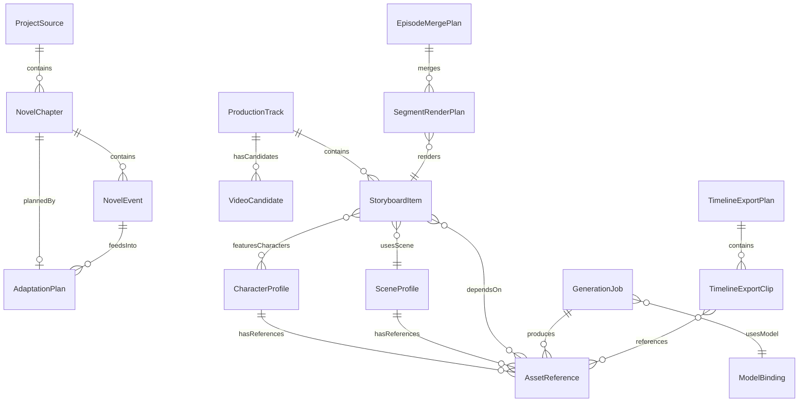
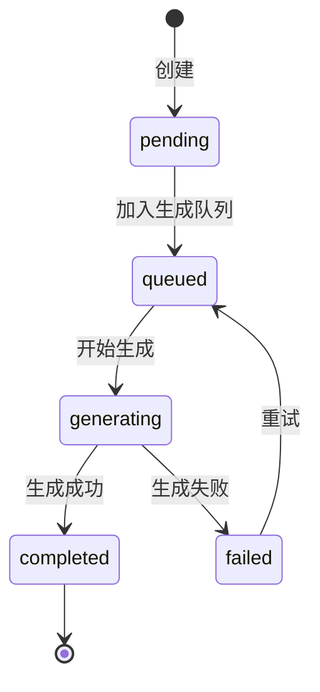
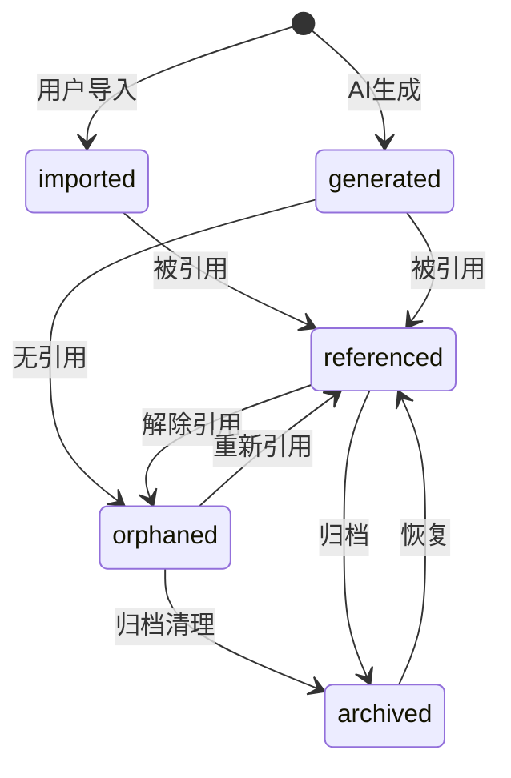

# 数据模型与接口规范

> **版本**: v1.0.0  
> **最后更新**: 2026-05-27  
> **状态**: 草案  
> **目标读者**: 全体开发人员

---

## 1. 文档目的与使用方式

### 1.1 定位

本文档是 MYStudio 融合项目的**数据模型权威参考**，涵盖：

- 所有实体的字段定义、类型、默认值、验证规则
- 实体间引用关系的完整映射
- Electron IPC 接口的请求/响应 schema
- 资产管理体系的目录结构与生命周期

### 1.2 使用方式

| 场景 | 使用方法 |
|------|---------|
| 新增字段 | 查阅对应实体定义，确认字段名、类型、默认值是否已存在 |
| 修改字段 | 确认引用该字段的所有实体，评估影响范围 |
| 新增 IPC 接口 | 参照第8节的 schema 模式，复用已有错误码体系 |
| 数据迁移 | 参照第6节的迁移策略，使用 store merge 补默认值 |
| 资产管理 | 参照第7节的三层目录结构与生命周期状态 |

### 1.3 标记约定

| 标记 | 含义 |
|------|------|
| `[已有]` | 字段已存在于当前代码库，保持兼容 |
| `[扩展]` | 已有字段，本次新增了属性或扩展了语义 |
| `[新增]` | 本次新增的字段/实体 |
| `[兼容]` | 保持向后兼容，旧数据无需迁移即可工作 |

---

## 2. 实体关系总览

### 2.1 核心实体关系图（Mermaid）



### 2.2 引用关系速查表

| 源实体 | 目标实体 | 关系类型 | 说明 |
|--------|---------|---------|------|
| ProjectSource | NovelChapter | 一对多 | 项目源包含多个章节 |
| NovelChapter | NovelEvent | 一对多 | 章节包含多个事件 |
| NovelChapter | AdaptationPlan | 一对一 | 每章一个改编计划 |
| NovelEvent | AdaptationPlan | 多对多 | 事件可跨集改编 |
| StoryboardItem | CharacterProfile | 多对多 | 镜头涉及多个角色 |
| StoryboardItem | SceneProfile | 多对一 | 镜头对应一个场景 |
| StoryboardItem | AssetReference | 多对多 | 镜头依赖多个资产 |
| ProductionTrack | StoryboardItem | 一对多 | 生产线包含多个镜头 |
| ProductionTrack | VideoCandidate | 一对多 | 生产线有多个候选视频 |
| GenerationJob | AssetReference | 一对多 | 生成任务产出多个资产 |
| GenerationJob | ModelBinding | 多对一 | 任务使用一个模型绑定 |
| TimelineExportClip | AssetReference | 多对多 | 时间线片段引用资产 |
| TimelineExportPlan | TimelineExportClip | 一对多 | 导出计划包含多个片段 |
| SegmentRenderPlan | StoryboardItem | 多对一 | 渲染计划对应一个镜头 |

---

## 3. 核心业务实体

### 3.0 ProjectSource — 项目源数据 [新增]

```typescript
/** 项目输入源，记录小说、剧本或媒体的原始来源 */
interface ProjectSource {
  /** 源唯一标识 */
  sourceId: string;
  /** 源类型 */
  kind: "novel" | "script" | "media";
  /** 原始文件名 */
  fileName: string | null;
  /** 源文本内容快照（小说/剧本） */
  content: string | null;
  /** 源媒体文件路径列表 */
  mediaPaths: string[];
  /** 导入时间 ISO 8601 */
  importedAt: string;
  /** 格式标记 */
  format: "txt" | "md" | "json" | "fountain" | "unknown";
  /** 是否为源快照（不可被覆盖） */
  isSnapshot: boolean;
}
```

### 3.1 NovelChapter — 小说章节

```typescript
interface NovelChapter {
  // ===== [已有] 基础字段 =====
  /** 章节唯一标识，格式: "ch-{index:03d}" */
  id: string;
  /** 章节序号，从1开始 */
  index: number;
  /** 章节标题 */
  title: string;
  /** 原始小说文本（完整内容） */
  sourceText: string;
  /** 事件摘要列表 */
  eventSummary: string[];
  /** 事件解析状态: "pending" | "parsed" | "confirmed" */
  eventState: "pending" | "parsed" | "confirmed";

  // ===== [扩展] 引用字段 =====
  /** 章节内事件ID列表，引用 NovelEvent.eventId */
  evidenceRefs: string[];
  /** 章节最后修改时间 ISO 8601 */
  updatedAt: string;
  /** 章节元数据 */
  metadata: ChapterMetadata;
}

/** [新增] 章节元数据 */
interface ChapterMetadata {
  /** 原始来源文件路径 */
  sourceFile?: string;
  /** 字数统计 */
  wordCount: number;
  /** 章节标签 */
  tags: string[];
}
```

### 3.2 NovelEvent — 小说事件 [新增]

```typescript
interface NovelEvent {
  /** 事件唯一标识，格式: "evt-{chapterIndex:03d}-{seq:03d}" */
  eventId: string;
  /** 所属章节序号，引用 NovelChapter.index */
  chapterIndex: number;
  /** 事件类型 */
  eventType: "dialogue" | "action" | "narration" | "transition" | "climax" | "resolution";
  /** 涉及角色ID列表，引用 CharacterProfile.characterId */
  characters: string[];
  /** 涉及地点列表 */
  locations: string[];
  /** 冲突描述 */
  conflicts: string[];
  /** 动作描述 */
  actions: string[];
  /** 关联资产引用ID列表，引用 AssetReference.assetId */
  evidenceRefs: string[];
  /** 事件文本内容（原文摘录） */
  text: string;
  /** 事件在章节中的排序权重 */
  sortOrder: number;
}
```

### 3.3 AdaptationPlan — 改编计划 [新增]

```typescript
interface AdaptationPlan {
  /** 计划唯一标识，格式: "plan-{chapterId}" */
  planId: string;
  /** 源章节ID，引用 NovelChapter.id */
  chapterId: string;
  /** 目标集数 */
  targetEpisodeCount: number;
  /** 压缩策略 */
  compressionStrategy: "selective" | "condensed" | "expanded";
  /** 集大纲列表（每个集对应一个大纲） */
  episodeOutlines: EpisodeOutline[];
  /** 计划状态 */
  status: "draft" | "confirmed" | "in_production" | "completed";
  /** 创建时间 ISO 8601 */
  createdAt: string;
  /** 更新时间 ISO 8601 */
  updatedAt: string;
}

/** [新增] 集大纲 */
interface EpisodeOutline {
  /** 集号 */
  episodeNumber: number;
  /** 集标题 */
  title: string;
  /** 包含的事件ID列表，引用 NovelEvent.eventId */
  eventIds: string[];
  /** 集简介 */
  synopsis: string;
  /** 预估时长（秒） */
  estimatedDuration: number;
  /** 情感基调 */
  mood: "warm" | "intense" | "suspense" | "melancholy" | "comedic";
}
```

### 3.4 AgentWorkData — Agent工作数据

```typescript
interface AgentWorkData {
  // ===== [已有] 基础字段 =====
  /** 数据键，格式: "{agentType}:{episodeId}:{stepName}" */
  key: string;
  /** 工作数据内容（JSON序列化） */
  data: unknown;
  /** 所属集ID */
  episodeId: string;

  // ===== [扩展] 版本与来源 =====
  /** 数据版本号，每次更新自增 */
  version: number;
  /** 数据来源: "agent" | "manual" | "import" */
  source: "agent" | "manual" | "import";
  /** 审查结果 */
  reviewResult: ReviewResult | null;
  /** 数据状态: "draft" | "approved" | "rejected" */
  status: "draft" | "approved" | "rejected";
  /** 创建时间 ISO 8601 */
  createdAt: string;
  /** 更新时间 ISO 8601 */
  updatedAt: string;
}

/** [新增] 审查结果 */
interface ReviewResult {
  /** 审查是否通过 */
  passed: boolean;
  /** 审查分数 0-100 */
  score: number;
  /** 审查意见列表 */
  comments: ReviewComment[];
  /** 审查时间 ISO 8601 */
  reviewedAt: string;
}

interface ReviewComment {
  /** 评论类型 */
  type: "error" | "warning" | "suggestion";
  /** 关联字段路径 */
  field?: string;
  /** 评论内容 */
  message: string;
}
```

### 3.5 CharacterProfile — 角色档案 [新增]

```typescript
interface CharacterProfile {
  /** 角色唯一标识，格式: "char-{nameSlug}" */
  characterId: string;
  /** 角色名称 */
  name: string;
  /** 角色别名/昵称列表 */
  aliases: string[];
  /** 外观锚点（用于AI生成一致性） */
  appearanceAnchors: AppearanceAnchor[];
  /** 声音ID，引用音频资产 */
  voiceId: string | null;
  /** 参考资产ID列表，引用 AssetReference.assetId */
  referenceAssetIds: string[];
  /** 性格描述 */
  personality: string;
  /** 角色定位 */
  role: "protagonist" | "antagonist" | "supporting" | "minor" | "background";
  /** 角色简介 */
  bio: string;
  /** 首次出场章节 */
  firstAppearance: number | null;
  /** 标签 */
  tags: string[];
  /** 创建时间 ISO 8601 */
  createdAt: string;
  /** 更新时间 ISO 8601 */
  updatedAt: string;
}

/** [新增] 外观锚点 */
interface AppearanceAnchor {
  /** 锚点类型 */
  kind: "face" | "body" | "hair" | "costume" | "accessory";
  /** 描述文本 */
  description: string;
  /** 参考资产ID */
  referenceAssetId: string | null;
  /** 权重 0-1，越高越重要 */
  weight: number;
}
```

### 3.6 SceneProfile — 场景档案 [新增]

```typescript
interface SceneProfile {
  /** 场景唯一标识，格式: "scene-{locationSlug}" */
  sceneId: string;
  /** 地点名称 */
  location: string;
  /** 时代背景 */
  era: string;
  /** 氛围描述 */
  atmosphere: string;
  /** 光照条件 */
  lighting: "natural_day" | "natural_dusk" | "natural_night" | "interior_warm" | "interior_cool" | "dramatic" | "mixed";
  /** 参考资产ID列表，引用 AssetReference.assetId */
  referenceAssetIds: string[];
  /** 环境音描述 */
  ambientSound: string;
  /** 天气条件 */
  weather: string | null;
  /** 标签 */
  tags: string[];
  /** 创建时间 ISO 8601 */
  createdAt: string;
  /** 更新时间 ISO 8601 */
  updatedAt: string;
}
```

### 3.7 StoryboardItem — 分镜/镜头项 [扩展]

StoryboardItem 是核心业务实体中字段最多的，按功能分为6组。

```typescript
interface StoryboardItem {
  // ===== 基础标识 =====
  /** 镜头唯一标识 */
  id: string;
  /** 所属集ID */
  episodeId: string;
  /** 镜头序号 */
  shotIndex: number;

  // ===== 第1组：镜头字段 =====
  /** [已有] 镜头标题 */
  title: string;
  /** [已有] 景别: "extreme_close" | "close" | "medium" | "medium_full" | "full" | "wide" | "extreme_wide" */
  shotType: ShotType;
  /** [已有] 角度: "eye" | "high" | "low" | "bird" | "worm" | "dutch" */
  angle: CameraAngle;
  /** [已有] 运镜: "static" | "pan" | "tilt" | "dolly" | "crane" | "handheld" | "tracking" */
  movement: CameraMovement;
  /** [已有] 场景描述 */
  location: string;
  /** [已有] 时间: "dawn" | "morning" | "noon" | "afternoon" | "dusk" | "night" | "late_night" */
  time: TimeOfDay;
  /** [已有] 动作描述 */
  action: string;
  /** [已有] 结果描述 */
  result: string;
  /** [已有] 氛围 */
  atmosphere: string;

  // ===== 第2组：提示词字段 =====
  /** [已有] 图像生成提示词 */
  imagePrompt: string;
  /** [已有] 视频生成提示词 */
  videoPrompt: string;
  /** [已有] 背景音乐提示词 */
  bgmPrompt: string;
  /** [已有] 音效描述 */
  soundEffect: string;

  // ===== 第3组：绑定字段 [扩展] =====
  /** [扩展] 场景ID，引用 SceneProfile.sceneId */
  sceneId: string | null;
  /** [扩展] 角色ID列表，引用 CharacterProfile.characterId */
  characterIds: string[];
  /** [扩展] 资产ID列表，引用 AssetReference.assetId */
  assetIds: string[];

  // ===== 第4组：音频字段 [扩展] =====
  /** [扩展] 语音ID */
  voiceId: string | null;
  /** [扩展] TTS音频引用路径 */
  ttsAudioRef: string | null;
  /** [扩展] 背景音乐引用路径 */
  bgmRef: string | null;
  /** [扩展] 音效引用路径列表 */
  soundEffectRefs: string[];

  // ===== 第5组：字幕字段 [扩展] =====
  /** [已有] 对话内容 */
  dialogue: string;
  /** [扩展] 字幕文本（可能与dialogue不同，含翻译等） */
  subtitleText: string | null;
  /** [扩展] 字幕样式 */
  subtitleStyle: SubtitleStyle | null;
  /** [扩展] 字幕资产引用路径 */
  subtitleRef: string | null;

  // ===== 第6组：状态字段 [扩展] =====
  /** [扩展] 图像生成状态 */
  imageState: GenerationState;
  /** [扩展] 视频生成状态 */
  videoState: GenerationState;
  /** [扩展] TTS生成状态 */
  ttsState: GenerationState;
  /** [扩展] 合成状态 */
  composeState: GenerationState;
}
```

#### 辅助类型定义

```typescript
/** 景别枚举 */
type ShotType = "extreme_close" | "close" | "medium" | "medium_full" | "full" | "wide" | "extreme_wide";

/** 摄像角度枚举 */
type CameraAngle = "eye" | "high" | "low" | "bird" | "worm" | "dutch";

/** 运镜方式枚举 */
type CameraMovement = "static" | "pan" | "tilt" | "dolly" | "crane" | "handheld" | "tracking";

/** 时间段枚举 */
type TimeOfDay = "dawn" | "morning" | "noon" | "afternoon" | "dusk" | "night" | "late_night";

/** 生成状态 */
type GenerationState = "pending" | "in_progress" | "completed" | "failed" | "skipped";

/** [新增] 字幕样式 */
interface SubtitleStyle {
  /** 字体 */
  fontFamily: string;
  /** 字号 */
  fontSize: number;
  /** 字体颜色（CSS色值） */
  color: string;
  /** 描边颜色 */
  outlineColor: string;
  /** 描边宽度 */
  outlineWidth: number;
  /** 背景色 */
  backgroundColor: string | null;
  /** 背景透明度 0-1 */
  backgroundOpacity: number;
  /** 对齐方式 */
  alignment: "left" | "center" | "right";
  /** 位置: "top" | "bottom" | "middle" */
  position: "top" | "bottom" | "middle";
  /** 垂直偏移（像素，正值向下） */
  verticalOffset: number;
  /** 行间距（倍数，默认1.2） */
  lineSpacing: number;
  /** 最大行数（超出截断） */
  maxLines: number;
}
```

> **StoryboardItem 状态流转**：每个分镜有4个独立子状态（imageState/videoState/ttsState/composeState），各自独立流转：



适用于 imageState、videoState、ttsState、composeState 四个字段，状态值均为：`pending | queued | generating | completed | failed`。

### 3.8 AssetReference — 资产引用 [新增]

```typescript
interface AssetReference {
  /** 资产唯一标识，格式: "asset-{uuid}" */
  assetId: string;
  /** 资产类型 */
  kind: AssetKind;
  /** 源文件路径（相对于项目根目录） */
  sourcePath: string;
  /** 来源类型 */
  sourceType: "imported" | "generated" | "builtin";
  /** 用途 */
  purpose: "reference" | "material" | "output" | "intermediate" | "cache";
  /** 绑定实体类型 */
  boundEntityType: "storyboard" | "character" | "scene" | "export" | "none" | null;
  /** 绑定实体ID */
  boundEntityId: string | null;
  /** 生成该资产的Job ID，引用 GenerationJob.jobId */
  generatedByJobId: string | null;
  /** 创建时间 ISO 8601 */
  createdAt: string;
  /** 资产元数据 */
  metadata: AssetMetadata;
  /** 内容哈希（用于去重） */
  contentHash: string;
  /** 文件大小（字节） */
  fileSize: number;
  /** 生命周期状态 */
  lifecycleState: AssetLifecycleState;
}

/** 资产类型枚举 */
type AssetKind =
  | "image"          // 静态图片
  | "video"          // 视频文件
  | "audio"          // 音频文件（BGM/SFX）
  | "tts"            // TTS生成的语音
  | "subtitle"       // 字幕文件
  | "model_3d"       // 3D模型
  | "lora"           // LoRA权重
  | "checkpoint"     // 模型检查点
  | "workflow"       // ComfyUI工作流
  | "template"       // 模板文件
  | "font"           // 字体文件
  | "other";         // 其他类型

/** 资产生命周期状态 */
type AssetLifecycleState = "imported" | "generated" | "referenced" | "orphaned" | "archived";

/** 资产元数据 */
interface AssetMetadata {
  /** 图片宽度 */
  width?: number;
  /** 图片高度 */
  height?: number;
  /** 视频时长（秒） */
  duration?: number;
  /** 音频采样率 */
  sampleRate?: number;
  /** 音频声道数 */
  channels?: number;
  /** 文件MIME类型 */
  mimeType?: string;
  /** 文件格式 */
  format?: string;
  /** 标签 */
  tags?: string[];
  /** 自定义扩展字段 */
  [key: string]: unknown;
}
```

### 3.9 GenerationJob — 生成任务 [新增]

```typescript
interface GenerationJob {
  /** 任务唯一标识，格式: "job-{uuid}" */
  jobId: string;
  /** 任务类型 */
  kind: "image" | "video" | "tts" | "compose" | "subtitle" | "export";
  /** 输入资产引用ID列表，引用 AssetReference.assetId */
  inputRefs: string[];
  /** 模型绑定ID，引用 ModelBinding.bindingId */
  modelBindingId: string;
  /** 产出资产ID列表，引用 AssetReference.assetId */
  outputAssetIds: string[];
  /** 任务状态 */
  status: "queued" | "running" | "completed" | "failed" | "cancelled";
  /** 错误信息（仅失败时） */
  error: GenerationError | null;
  /** 进度百分比 0-100 */
  progress: number;
  /** 任务参数（JSON，取决于kind） */
  params: Record<string, unknown>;
  /** 创建时间 ISO 8601 */
  createdAt: string;
  /** 更新时间 ISO 8601 */
  updatedAt: string;
}

/** [新增] 生成错误 */
interface GenerationError {
  /** 错误码 */
  code: string;
  /** 错误消息 */
  message: string;
  /** 错误详情 */
  details: string | null;
  /** 是否可重试 */
  retryable: boolean;
  /** 重试次数 */
  retryCount: number;
  /** 最大重试次数 */
  maxRetries: number;
}
```

### 3.10 ProductionTrack — 生产线

```typescript
interface ProductionTrack {
  // ===== [已有] 基础字段 =====
  /** 生产线唯一标识 */
  id: string;
  /** 所属集ID */
  episodeId: string;
  /** 镜头项列表 */
  items: StoryboardItem[];
  /** 候选视频列表 */
  candidates: VideoCandidate[];

  // ===== [扩展] 时间线字段 =====
  /** 生产线在时间线中的轨道序号 */
  trackIndex: number;
  /** 轨道类型 */
  trackType: "video" | "audio" | "subtitle" | "overlay";
  /** 起始时间（秒） */
  startTime: number;
  /** 总时长（秒） */
  duration: number;
  /** 生产线状态 */
  status: "idle" | "generating" | "composing" | "reviewing" | "completed";
  /** 创建时间 ISO 8601 */
  createdAt: string;
  /** 更新时间 ISO 8601 */
  updatedAt: string;
}
```

### 3.11 VideoCandidate — 视频候选

```typescript
interface VideoCandidate {
  // ===== [已有] 基础字段 =====
  /** 候选唯一标识 */
  id: string;
  /** 所属生产线ID */
  trackId: string;
  /** 视频文件路径 */
  filePath: string;
  /** 生成状态 */
  state: "pending" | "generating" | "completed" | "failed" | "discarded";

  // ===== [扩展] 详细信息 =====
  /** 生成来源: "comfyui" | "wanx" | "runway" | "manual" */
  provider: string;
  /** 生成来源档案/配置 */
  profile: string | null;
  /** 错误信息 */
  error: string | null;
  /** 缩略图路径 */
  thumbnail: string | null;
  /** 视频时长（秒） */
  duration: number;
  /** 质量评分 0-100 */
  qualityScore: number | null;
  /** 是否为选中候选 */
  isSelected: boolean;
  /** 关联GenerationJob ID */
  jobId: string | null;
  /** 创建时间 ISO 8601 */
  createdAt: string;
}
```

---

## 4. 导出计划实体

### 4.1 TimelineExportClip — 时间线导出片段 [新增]

```typescript
interface TimelineExportClip {
  /** 片段唯一标识 */
  id: string;
  /** 片段类型 */
  kind: "video" | "audio" | "subtitle" | "image" | "transition";
  /** 起始时间（秒，相对于导出计划原点） */
  startTime: number;
  /** 片段时长（秒） */
  duration: number;
  /** 裁剪起点（秒，相对于源资产） */
  trimStart: number;
  /** 播放速度倍率，默认1.0 */
  speed: number;
  /** 是否倒放 */
  reversed: boolean;
  /** 所在轨道序号 */
  trackIndex: number;
  /** 音量 0-1，默认1.0 */
  volume: number;
  /** 是否静音 */
  muted: boolean;
  /** 文本内容（字幕/标题） */
  text: string | null;
  /** 样式配置 */
  style: ClipStyle | null;
  /** 源资产ID，引用 AssetReference.assetId */
  sourceAssetId: string;
}
```

```typescript
/** [新增] 片段样式 */
interface ClipStyle {
  /** 透明度 0-1 */
  opacity: number;
  /** 混合模式 */
  blendMode: "normal" | "multiply" | "screen" | "overlay" | "add";
  /** 缩放 { x, y } 或统一缩放值 */
  scale: number | { x: number; y: number };
  /** 旋转角度 */
  rotation: number;
  /** 位置偏移 { x, y } */
  position: { x: number; y: number };
  /** 锚点 { x, y }，默认 {0.5, 0.5} 居中 */
  anchor: { x: number; y: number };
}
```

### 4.2 TimelineExportPlan — 时间线导出计划 [新增]

```typescript
interface TimelineExportPlan {
  /** 计划类型标识 */
  kind: "timeline_export";
  /** 导出片段列表 */
  clips: TimelineExportClip[];
  /** 输出文件路径 */
  outputPath: string;
  /** 视频宽度（像素） */
  width: number;
  /** 视频高度（像素） */
  height: number;
  /** 帧率 */
  fps: number;
  /** 编码器 */
  codec: "h264" | "h265" | "vp9" | "av1";
  /** 质量等级 */
  quality: "low" | "medium" | "high" | "lossless";
  /** FFmpeg额外参数 */
  ffmpegProfile: FFmpegProfile;
  /** 关联集ID */
  episodeId: string;
  /** 创建时间 ISO 8601 */
  createdAt: string;
}
```

```typescript
/** [新增] FFmpeg配置 */
interface FFmpegProfile {
  /** 编码器预设 */
  preset: "ultrafast" | "superfast" | "veryfast" | "faster" | "fast" | "medium" | "slow" | "slower" | "veryslow";
  /** CRF值（仅H.264/H.265） */
  crf: number;
  /** 码率（bps），与crf二选一 */
  bitrate: number | null;
  /** 像素格式 */
  pixelFormat: "yuv420p" | "yuv422p" | "yuv444p" | "rgb24";
  /** 关键帧间隔 */
  gopSize: number;
  /** 音频编码器 */
  audioCodec: "aac" | "mp3" | "opus" | "flac";
  /** 音频码率 */
  audioBitrate: number;
  /** 额外FFmpeg参数 */
  extraArgs: string[];
}
```

### 4.3 SegmentRenderPlan — 片段渲染计划 [新增]

```typescript
interface SegmentRenderPlan {
  /** 关联的分镜ID，引用 StoryboardItem.id */
  storyboardId: string;
  /** 语音音频路径（TTS产出） */
  audioPath: string | null;
  /** 视频媒体路径（视频生成产出） */
  mediaPath: string | null;
  /** 合成结果路径（音频+视频+字幕合成） */
  composedPath: string | null;
  /** 最终片段输出路径 */
  segmentPath: string | null;
  /** 使用的模板引用 */
  templateRef: string | null;
  /** 最终输出路径（集合并后） */
  outputPath: string | null;
  /** 渲染状态 */
  status: "pending" | "rendering" | "completed" | "failed";
  /** 错误信息 */
  error: string | null;
  /** 片段时长（秒） */
  duration: number;
  /** 片段序号（在集中的顺序） */
  segmentIndex: number;
}
```

### 4.4 TrackRenderPlan — 轨道渲染计划 [兼容]

> 保持现有结构，增加兼容性说明。

```typescript
interface TrackRenderPlan {
  /** 轨道唯一标识 */
  id: string;
  /** 所属集ID */
  episodeId: string;
  /** 轨道索引 */
  trackIndex: number;
  /** 轨道类型 */
  trackType: "video" | "audio" | "subtitle";
  /** 渲染候选列表 */
  candidates: VideoCandidate[];
  /** 选中的候选ID */
  selectedCandidateId: string | null;
  /** 渲染状态 */
  state: "pending" | "rendering" | "done" | "error";
  /** 错误信息 */
  error: string | null;
}
```

### 4.5 EpisodeMergePlan — 集合并计划 [兼容]

> 保持现有结构，增加兼容性说明。

```typescript
interface EpisodeMergePlan {
  /** 合并计划唯一标识 */
  id: string;
  /** 集ID */
  episodeId: string;
  /** 待合并的片段渲染计划列表 */
  segments: SegmentRenderPlan[];
  /** 轨道渲染计划列表 */
  tracks: TrackRenderPlan[];
  /** 最终输出路径 */
  outputPath: string;
  /** 合并状态 */
  state: "pending" | "merging" | "done" | "error";
  /** 错误信息 */
  error: string | null;
  /** FFmpeg合并参数 */
  mergeOptions: {
    /** 过渡效果列表 */
    transitions: TransitionDef[];
    /** 全局水印 */
    watermark: string | null;
    /** 片头路径 */
    introPath: string | null;
    /** 片尾路径 */
    outroPath: string | null;
  };
}

/** [兼容] 过渡效果定义 */
interface TransitionDef {
  /** 过渡类型 */
  type: "cut" | "dissolve" | "fade" | "wipe" | "slide";
  /** 过渡时长（秒） */
  duration: number;
  /** 作用的片段序号（过渡结束位置） */
  segmentIndex: number;
}
```

---

## 5. 配置实体

### 5.1 VendorConfig — 供应商配置 [扩展]

```typescript
interface VendorConfig {
  /** 供应商标识 */
  vendorId: string;
  /** 供应商名称 */
  name: string;
  /** 供应商类型 */
  type: "comfyui" | "wanx" | "runway" | "openai" | "elevenlabs" | "local";
  /** API端点 */
  endpoint: string;
  /** API密钥（加密存储） */
  apiKey: string | null;
  /** 是否启用 */
  enabled: boolean;
  /** 能力标签 [扩展] */
  capabilities: VendorCapability[];
  /** 供应商特定配置 */
  config: Record<string, unknown>;
  /** 最大并发数 */
  maxConcurrency: number;
  /** 速率限制（请求/分钟） */
  rateLimit: number;
  /** 超时时间（毫秒） */
  timeout: number;
}

/** [新增] 供应商能力标签 */
type VendorCapability =
  | "image_generation"     // 图像生成
  | "video_generation"     // 视频生成
  | "tts"                  // 文本转语音
  | "stt"                  // 语音转文本
  | "image_upscale"        // 图像超分辨率
  | "image_edit"           // 图像编辑
  | "video_edit"           // 视频编辑
  | "subtitle_generation"  // 字幕生成
  | "style_transfer"       // 风格迁移
  | "face_swap"            // 人脸替换
  | "lip_sync";            // 口型同步
```

### 5.2 ModelDefinition — 模型定义 [已有]

```typescript
interface ModelDefinition {
  /** 模型唯一标识 */
  modelId: string;
  /** 模型名称 */
  name: string;
  /** 所属供应商ID，引用 VendorConfig.vendorId */
  vendorId: string;
  /** 模型类型 */
  type: "checkpoint" | "lora" | "vae" | "controlnet" | "tts" | "embedding";
  /** 模型路径（本地或远程） */
  modelPath: string;
  /** 模型版本 */
  version: string;
  /** 支持的输入格式 */
  inputFormats: string[];
  /** 支持的输出格式 */
  outputFormats: string[];
  /** 默认参数 */
  defaultParams: Record<string, unknown>;
  /** 描述 */
  description: string;
  /** 是否启用 */
  enabled: boolean;
}
```

### 5.3 ModelBinding — 模型绑定 [扩展]

```typescript
interface ModelBinding {
  /** 绑定唯一标识 */
  bindingId: string;
  /** 绑定名称 */
  name: string;
  /** 绑定的模型组合 */
  models: ModelBindingEntry[];
  /** 绑定用途 */
  purpose: "image" | "video" | "tts" | "compose";
  /** 绑定参数覆盖 */
  paramOverrides: Record<string, unknown>;
  /** 优先使用的供应商ID [扩展] */
  preferredVendorId: string | null;
  /** 备选供应商ID列表 [扩展] */
  fallbackVendorIds: string[];
  /** 创建时间 ISO 8601 */
  createdAt: string;
  /** 更新时间 ISO 8601 */
  updatedAt: string;
}

/** [新增] 模型绑定条目 */
interface ModelBindingEntry {
  /** 模型ID，引用 ModelDefinition.modelId */
  modelId: string;
  /** 权重（用于多LoRA组合） */
  weight: number;
  /** 绑定键 [扩展]: "base" | "style" | "character" | "control" | "refiner" */
  bindingKey: string;
  /** 该条目是否启用 */
  enabled: boolean;
}
```

### 5.4 SkillContextPackage — 技能上下文包 [扩展]

```typescript
interface SkillContextPackage {
  /** 包唯一标识 */
  packageId: string;
  /** 技能名称 */
  skillName: string;
  /** 上下文数据 */
  context: Record<string, unknown>;
  /** 版本号 [扩展] */
  version: string;
  /** 引用的模型绑定ID [扩展] */
  modelBindingId: string | null;
  /** 引用的供应商配置ID [扩展] */
  vendorConfigId: string | null;
  /** 依赖的其他上下文包ID [扩展] */
  dependencyPackageIds: string[];
  /** 创建时间 ISO 8601 */
  createdAt: string;
  /** 更新时间 ISO 8601 */
  updatedAt: string;
  /** 包描述 */
  description: string;
}
```

---

## 6. 字段级规范

### 6.1 StoryboardItem 字段分组详表

| 字段名 | 类型 | 默认值 | Phase | 验证规则 |
|--------|------|--------|-------|---------|
| **第1组：镜头字段** | | | | |
| title | string | "" | Phase 1 | 非空，≤50字符 |
| shotType | ShotType | "medium" | Phase 1 | 枚举值之一 |
| angle | CameraAngle | "eye" | Phase 1 | 枚举值之一 |
| movement | CameraMovement | "static" | Phase 1 | 枚举值之一 |
| location | string | "" | Phase 1 | 非空 |
| time | TimeOfDay | "noon" | Phase 1 | 枚举值之一 |
| action | string | "" | Phase 1 | 非空，≤500字符 |
| result | string | "" | Phase 1 | ≤500字符 |
| atmosphere | string | "" | Phase 1 | ≤200字符 |
| **第2组：提示词字段** | | | | |
| imagePrompt | string | "" | Phase 2 | 非空（生成时） |
| videoPrompt | string | "" | Phase 2 | 非空（生成时） |
| bgmPrompt | string | "" | Phase 2 | ≤300字符 |
| soundEffect | string | "" | Phase 2 | ≤300字符 |
| **第3组：绑定字段** | | | | |
| sceneId | string\|null | null | Phase 2 | 引用 SceneProfile.sceneId |
| characterIds | string[] | [] | Phase 2 | 元素引用 CharacterProfile.characterId |
| assetIds | string[] | [] | Phase 2 | 元素引用 AssetReference.assetId |
| **第4组：音频字段** | | | | |
| voiceId | string\|null | null | Phase 3 | 引用音频资产 |
| ttsAudioRef | string\|null | null | Phase 3 | 有效路径 |
| bgmRef | string\|null | null | Phase 3 | 有效路径 |
| soundEffectRefs | string[] | [] | Phase 3 | 元素为有效路径 |
| **第5组：字幕字段** | | | | |
| dialogue | string | "" | Phase 1 | ≤1000字符 |
| subtitleText | string\|null | null | Phase 3 | ≤1000字符 |
| subtitleStyle | SubtitleStyle\|null | null | Phase 3 | - |
| subtitleRef | string\|null | null | Phase 3 | 有效路径 |
| **第6组：状态字段** | | | | |
| imageState | GenerationState | "pending" | Phase 2 | 枚举值之一 |
| videoState | GenerationState | "pending" | Phase 2 | 枚举值之一 |
| ttsState | GenerationState | "pending" | Phase 3 | 枚举值之一 |
| composeState | GenerationState | "pending" | Phase 3 | 枚举值之一 |

### 6.2 旧数据迁移策略

#### 迁移原则

1. **Store Merge 补默认值**：读取旧数据时，与新 schema 合并，缺失字段自动填充默认值
2. **类型字段可选**：新增的枚举类型字段在旧数据中不存在，应视为可选并设置合理默认值
3. **渐进式写入**：仅在用户实际编辑对应字段时才将新字段写入存储，避免全量重写

#### 迁移伪代码

```typescript
function migrateStoryboardItem(raw: Record<string, unknown>): StoryboardItem {
  // 默认值模板
  const defaults: StoryboardItem = {
    id: "", episodeId: "", shotIndex: 0,
    title: "", shotType: "medium", angle: "eye",
    movement: "static", location: "", time: "noon",
    action: "", result: "", atmosphere: "",
    imagePrompt: "", videoPrompt: "", bgmPrompt: "", soundEffect: "",
    sceneId: null, characterIds: [], assetIds: [],
    voiceId: null, ttsAudioRef: null, bgmRef: null, soundEffectRefs: [],
    dialogue: "", subtitleText: null, subtitleStyle: null, subtitleRef: null,
    imageState: "pending", videoState: "pending",
    ttsState: "pending", composeState: "pending",
  };
  // 深度合并，旧数据覆盖默认值
  return { ...defaults, ...raw };
}
```

#### 版本标记策略

- 每个实体增加 `schemaVersion` 字段（可选，默认为当前版本）
- 数据加载时检查版本号，触发对应版本的迁移函数
- 迁移函数链式调用：`v0 → v1 → v2 → ... → current`

### 6.3 字段验证规则

| 实体 | 字段 | 验证规则 | 错误提示 |
|------|------|---------|---------|
| NovelChapter | id | 正则 `^ch-\d{3,}$` | "章节ID格式错误，应为ch-NNN" |
| NovelChapter | index | ≥ 1，整数 | "章节序号必须≥1" |
| NovelEvent | eventId | 正则 `^evt-\d{3,}-\d{3,}$` | "事件ID格式错误" |
| CharacterProfile | characterId | 正则 `^char-[a-zA-Z0-9-]+$` | "角色ID格式错误" |
| CharacterProfile | name | 非空，≤50字符 | "角色名不能为空且不超过50字符" |
| SceneProfile | sceneId | 正则 `^scene-[a-zA-Z0-9-]+$` | "场景ID格式错误" |
| StoryboardItem | id | 正则 `^sb-[a-zA-Z0-9-]+$` | "分镜ID格式错误" |
| StoryboardItem | shotType | 枚举值之一 | "无效的景别" |
| StoryboardItem | duration | > 0 且 ≤ 300（秒） | "时长必须在0-300秒之间" |
| AssetReference | assetId | 正则 `^asset-[a-f0-9-]+$` | "资产ID格式错误" |
| AssetReference | sourcePath | 非空，路径存在性可选校验 | "资产路径不能为空" |
| GenerationJob | kind | 枚举值之一 | "无效的任务类型" |
| TimelineExportClip | trackIndex | ≥ 0 | "轨道序号不能为负" |
| TimelineExportClip | speed | > 0 且 ≤ 10 | "速度倍率必须在0-10之间" |
| TimelineExportClip | volume | ≥ 0 且 ≤ 1 | "音量必须在0-1之间" |
| TimelineExportPlan | fps | 枚举: 24/25/30/60 | "不支持的帧率" |

---

## 7. 资产管理体系

### 7.1 三层目录结构

```
project-root/
├── app-resources/              # 第1层：应用内置资源（随版本发布）
│   ├── models/                 # 内置模型
│   │   ├── checkpoints/        # 基础检查点
│   │   ├── loras/              # 内置LoRA
│   │   └── controlnet/         # ControlNet模型
│   ├── workflows/              # 内置ComfyUI工作流
│   ├── templates/              # 内置模板
│   │   ├── video/              # 视频模板
│   │   ├── subtitle/           # 字幕模板
│   │   └── transition/         # 转场模板
│   ├── fonts/                  # 内置字体
│   ├── audio/                  # 内置音频
│   │   ├── bgm/                # 背景音乐
│   │   └── sfx/                # 音效
│   └── presets/                # 预设配置
│       ├── styles/             # 风格预设
│       └── quality/            # 质量预设
│
├── user-data/                  # 第2层：用户全局资源（跨项目共享）
│   ├── models/                 # 用户导入的模型
│   ├── characters/             # 角色参考图
│   ├── scenes/                 # 场景参考图
│   ├── voices/                 # 语音样本
│   ├── styles/                 # 自定义风格
│   └── workflows/              # 自定义工作流
│
└── project/                    # 第3层：项目级资源（当前项目专属）
    ├── assets/                 # 项目资产
    │   ├── images/             # 生成的图片
    │   ├── videos/             # 生成的视频
    │   ├── audio/              # 生成的音频
    │   ├── subtitles/          # 生成的字幕
    │   └── composed/           # 合成产物
    ├── references/             # 项目参考图
    │   ├── characters/         # 角色参考
    │   └── scenes/             # 场景参考
    ├── exports/                # 导出产物
    └── cache/                  # 临时缓存（可清理）
```

### 7.2 资产生命周期状态

| 状态 | 说明 | 可转换到 |
|------|------|---------|
| `imported` | 用户手动导入的资产 | `referenced`, `archived` |
| `generated` | AI生成产出的资产 | `referenced`, `orphaned`, `archived` |
| `referenced` | 被至少一个实体引用 | `orphaned`, `archived` |
| `orphaned` | 无任何引用的资产 | `referenced`, `archived` |
| `archived` | 已归档，不参与日常查找 | `referenced`（恢复） |



### 7.3 引用关系与反查

每个 AssetReference 记录以下关联信息，支持双向查找：

```typescript
/** 资产引用查询接口 */
interface AssetQueryService {
  /** 正向查询：资产 → 引用它的实体列表 */
  findReferencingEntities(assetId: string): Promise<AssetReferenceResult[]>;

  /** 反向查询：实体 → 它引用的资产列表 */
  findReferencedAssets(entityType: string, entityId: string): Promise<AssetReference[]>;

  /** 查询孤儿资产（无引用的generated资产） */
  findOrphanedAssets(): Promise<AssetReference[]>;

  /** 批量更新引用关系 */
  updateReferences(
    entityType: string,
    entityId: string,
    addAssetIds: string[],
    removeAssetIds: string[]
  ): Promise<void>;
}

interface AssetReferenceResult {
  entityType: string;
  entityId: string;
  fieldName: string;
  referencedAt: string;
}
```

### 7.4 去重策略（Content Hash）

```typescript
/** 资产去重服务接口 */
interface AssetDeduplicationService {
  /**
   * 计算文件内容哈希
   * 算法: SHA-256（大文件使用分块哈希）
   */
  computeContentHash(filePath: string): Promise<string>;

  /**
   * 检查是否已存在相同内容的资产
   * 返回已存在的资产ID，或null表示无重复
   */
  findDuplicate(contentHash: string): Promise<AssetReference | null>;

  /**
   * 导入资产（自动去重）
   * - 已存在: 返回已有资产的引用
   * - 不存在: 创建新资产引用
   */
  importAsset(filePath: string, metadata: Partial<AssetMetadata>): Promise<AssetReference>;
}
```

**去重规则**：
1. 新资产导入时先计算 content hash
2. 查询已有资产中是否存在相同 hash
3. 如存在，且已有资产的 `boundEntityType` 不同，则创建新引用指向同一文件
4. 如存在且 `boundEntityType` 相同，直接返回已有引用

### 7.5 资源覆盖优先级

资源查找遵循 **project > user-data > app-resources** 优先级：

```typescript
/** 资源查找服务接口 */
interface ResourceResolutionService {
  /**
   * 按优先级查找资源
   * 1. project/ 目录
   * 2. user-data/ 目录
   * 3. app-resources/ 目录
   * 返回第一个找到的路径，或null
   */
  resolveResource(relativePath: string): Promise<string | null>;

  /**
   * 列出所有层级的同名资源（用于UI展示覆盖关系）
   */
  listResourceLayers(relativePath: string): Promise<ResourceLayer[]>;
}

interface ResourceLayer {
  layer: "app-resources" | "user-data" | "project";
  fullPath: string;
  exists: boolean;
  overridden: boolean; // 是否被更高优先级覆盖
}
```

---

## 8. Electron IPC 接口规范

### 8.1 总览

所有 IPC 通道统一使用 `studio-` 前缀，通过 Electron preload 桥接暴露给渲染进程。

#### Preload 桥接类型定义模式

```typescript
// preload.ts 中的类型定义模式
import { IpcRenderer } from "electron";

declare global {
  interface Window {
    studioAPI: {
      // 通用调用方法
      invoke<TReq, TRes>(channel: string, request: TReq): Promise<TRes>;
      // 事件监听
      on(channel: string, callback: (...args: any[]) => void): () => void;
    };
  }
}

// 使用示例
const result = await window.studioAPI.invoke<SaveMaterialRequest, SaveMaterialResponse>(
  "studio-save-material",
  { ... }
);
```

### 8.2 现有兼容接口

#### 8.2.1 studio-save-material — 保存素材

```
通道: studio-save-material
方向: Renderer → Main（invoke）
用途: 将生成结果保存为项目素材
```

```typescript
interface SaveMaterialRequest {
  /** 素材类型 */
  kind: "image" | "video" | "audio";
  /** 源文件路径（临时文件） */
  sourcePath: string;
  /** 目标相对路径 */
  targetPath: string;
  /** 关联的分镜ID */
  storyboardId: string;
  /** 元数据 */
  metadata?: Record<string, unknown>;
}

interface SaveMaterialResponse {
  /** 是否成功 */
  success: boolean;
  /** 创建的资产ID */
  assetId: string | null;
  /** 错误信息 */
  error: StudioError | null;
}
```

#### 8.2.2 studio-render-track-candidate — 渲染轨道候选

```
通道: studio-render-track-candidate
方向: Renderer → Main（invoke）
用途: 为指定轨道生成视频候选
```

```typescript
interface RenderTrackCandidateRequest {
  /** 生产线ID */
  trackId: string;
  /** 分镜ID */
  storyboardId: string;
  /** 渲染参数 */
  params: {
    imagePrompt: string;
    videoPrompt: string;
    modelBindingId: string;
    width: number;
    height: number;
  };
}

interface RenderTrackCandidateResponse {
  /** 是否成功 */
  success: boolean;
  /** 生成任务ID */
  jobId: string | null;
  /** 候选ID */
  candidateId: string | null;
  /** 错误信息 */
  error: StudioError | null;
}
```

#### 8.2.3 studio-merge-episode — 合并集

```
通道: studio-merge-episode
方向: Renderer → Main（invoke）
用途: 将集中的所有片段合并为最终视频
```

```typescript
interface MergeEpisodeRequest {
  /** 集ID */
  episodeId: string;
  /** 合并选项 */
  options: {
    outputPath: string;
    transitions: TransitionDef[];
    watermark: string | null;
    introPath: string | null;
    outroPath: string | null;
    quality: "low" | "medium" | "high";
  };
}

interface MergeEpisodeResponse {
  /** 是否成功 */
  success: boolean;
  /** 输出文件路径 */
  outputPath: string | null;
  /** 错误信息 */
  error: StudioError | null;
}
```

### 8.3 Phase 2 新增接口

#### 8.3.1 studio-probe-media — 探测媒体信息

```
通道: studio-probe-media
方向: Renderer → Main（invoke）
用途: 使用 ffprobe 获取媒体文件元数据
```

```typescript
interface ProbeMediaRequest {
  /** 媒体文件路径 */
  filePath: string;
  /** 是否获取完整流信息 */
  verbose: boolean;
}

interface ProbeMediaResponse {
  /** 是否成功 */
  success: boolean;
  /** 媒体信息 */
  mediaInfo: MediaInfo | null;
  /** 错误信息 */
  error: StudioError | null;
}

interface MediaInfo {
  /** 时长（秒） */
  duration: number;
  /** 视频流信息 */
  videoStream: VideoStreamInfo | null;
  /** 音频流信息 */
  audioStreams: AudioStreamInfo[];
  /** 文件格式 */
  format: string;
  /** 文件大小（字节） */
  fileSize: number;
}

interface VideoStreamInfo {
  width: number;
  height: number;
  fps: number;
  codec: string;
  bitrate: number;
  pixelFormat: string;
}

interface AudioStreamInfo {
  codec: string;
  sampleRate: number;
  channels: number;
  bitrate: number;
  language: string | null;
}
```

#### 8.3.2 studio-compose-shot — 合成镜头

```
通道: studio-compose-shot
方向: Renderer → Main（invoke）
用途: 将视频+音频+字幕合成为最终镜头片段
```

```typescript
interface ComposeShotRequest {
  /** 分镜ID */
  storyboardId: string;
  /** 视频路径 */
  videoPath: string;
  /** 音频路径 */
  audioPath: string | null;
  /** 字幕路径 */
  subtitlePath: string | null;
  /** 合成参数 */
  options: {
    width: number;
    height: number;
    fps: number;
    codec: string;
    quality: string;
  };
}

interface ComposeShotResponse {
  /** 是否成功 */
  success: boolean;
  /** 输出路径 */
  outputPath: string | null;
  /** 输出时长（秒） */
  duration: number;
  /** 错误信息 */
  error: StudioError | null;
}
```

### 8.4 Phase 3 新增接口

#### 8.4.1 studio-export-timeline — 导出时间线

```
通道: studio-export-timeline
方向: Renderer → Main（invoke）
用途: 根据TimelineExportPlan执行完整的视频导出
```

```typescript
interface ExportTimelineRequest {
  /** 导出计划 */
  plan: TimelineExportPlan;
  /** 导出选项 */
  options: {
    /** 是否覆盖已有文件 */
    overwrite: boolean;
    /** 进度回调间隔（毫秒） */
    progressInterval: number;
  };
}

interface ExportTimelineResponse {
  /** 是否成功 */
  success: boolean;
  /** 输出文件路径 */
  outputPath: string | null;
  /** 导出耗时（毫秒） */
  elapsedMs: number;
  /** 错误信息 */
  error: StudioError | null;
}

// 进度通知（通过 ipcRenderer.on 接收）
interface ExportProgressEvent {
  /** 任务ID */
  taskId: string;
  /** 当前进度 0-100 */
  progress: number;
  /** 当前处理阶段 */
  phase: "preparing" | "rendering_clips" | "compositing" | "encoding" | "finalizing";
  /** 预计剩余时间（秒） */
  estimatedRemaining: number;
}
```

#### 8.4.2 studio-export-cancel — 取消导出

```
通道: studio-export-cancel
方向: Renderer → Main（invoke）
用途: 取消正在进行的导出任务
```

```typescript
interface ExportCancelRequest {
  /** 要取消的任务ID */
  taskId: string;
  /** 是否清理已生成的临时文件 */
  cleanup: boolean;
}

interface ExportCancelResponse {
  /** 是否成功取消 */
  success: boolean;
  /** 是否已清理临时文件 */
  cleaned: boolean;
  /** 错误信息 */
  error: StudioError | null;
}
```

### 8.5 资源发现接口

#### 8.5.1 studio-list-resources — 列出资源

```
通道: studio-list-resources
方向: Renderer → Main（invoke）
用途: 列出指定目录下的资源文件
```

```typescript
interface ListResourcesRequest {
  /** 资源类型 */
  kind: AssetKind;
  /** 搜索路径（相对路径，空串表示根目录） */
  searchPath: string;
  /** 是否递归搜索 */
  recursive: boolean;
  /** 文件扩展名过滤 */
  extensions?: string[];
  /** 分页参数 */
  pagination?: {
    offset: number;
    limit: number;
  };
}

interface ListResourcesResponse {
  /** 资源列表 */
  resources: ResourceEntry[];
  /** 总数 */
  total: number;
}

interface ResourceEntry {
  /** 文件名 */
  name: string;
  /** 相对路径 */
  relativePath: string;
  /** 绝对路径 */
  fullPath: string;
  /** 文件大小 */
  fileSize: number;
  /** 修改时间 */
  modifiedAt: string;
  /** 是否为目录 */
  isDirectory: boolean;
  /** 缩略图路径（如可用） */
  thumbnailPath: string | null;
}
```

#### 8.5.2 studio-list-workflows — 列出工作流

```
通道: studio-list-workflows
方向: Renderer → Main（invoke）
用途: 列出可用的ComfyUI工作流
```

```typescript
interface ListWorkflowsRequest {
  /** 过滤条件 */
  filter?: {
    purpose?: "image" | "video" | "tts";
    tags?: string[];
  };
}

interface ListWorkflowsResponse {
  workflows: WorkflowEntry[];
}

interface WorkflowEntry {
  /** 工作流ID */
  workflowId: string;
  /** 工作流名称 */
  name: string;
  /** 描述 */
  description: string;
  /** 用途 */
  purpose: "image" | "video" | "tts";
  /** 标签 */
  tags: string[];
  /** 文件路径 */
  filePath: string;
  /** 所在层级 */
  layer: "app-resources" | "user-data" | "project";
}
```

#### 8.5.3 studio-list-templates — 列出模板

```
通道: studio-list-templates
方向: Renderer → Main（invoke）
用途: 列出可用的渲染模板
```

```typescript
interface ListTemplatesRequest {
  /** 模板类型过滤 */
  templateType?: "video" | "subtitle" | "transition";
}

interface ListTemplatesResponse {
  templates: TemplateEntry[];
}

interface TemplateEntry {
  /** 模板ID */
  templateId: string;
  /** 模板名称 */
  name: string;
  /** 描述 */
  description: string;
  /** 类型 */
  templateType: "video" | "subtitle" | "transition";
  /** 预览图路径 */
  previewPath: string | null;
  /** 参数定义 */
  paramDefs: TemplateParamDef[];
  /** 所在层级 */
  layer: "app-resources" | "user-data" | "project";
}
```

#### 8.5.4 studio-get-template-params — 获取模板参数

```
通道: studio-get-template-params
方向: Renderer → Main（invoke）
用途: 获取指定模板的详细参数定义
```

```typescript
interface GetTemplateParamsRequest {
  /** 模板ID */
  templateId: string;
}

interface GetTemplateParamsResponse {
  /** 模板ID */
  templateId: string;
  /** 参数定义列表 */
  paramDefs: TemplateParamDef[];
  /** 默认参数值 */
  defaultValues: Record<string, unknown>;
}

/** [新增] 模板参数定义 */
interface TemplateParamDef {
  /** 参数名 */
  name: string;
  /** 显示名 */
  label: string;
  /** 参数类型 */
  type: "string" | "number" | "boolean" | "enum" | "color" | "file" | "array";
  /** 是否必填 */
  required: boolean;
  /** 默认值 */
  defaultValue: unknown;
  /** 枚举选项（type为enum时） */
  enumOptions?: string[];
  /** 数值范围（type为number时） */
  range?: { min: number; max: number; step?: number };
  /** 描述 */
  description: string;
  /** 分组 */
  group: string;
}
```

#### 8.5.5 studio-render-template-preview — 渲染模板预览

```
通道: studio-render-template-preview
方向: Renderer → Main（invoke）
用途: 使用指定参数渲染模板预览图
```

```typescript
interface RenderTemplatePreviewRequest {
  /** 模板ID */
  templateId: string;
  /** 参数值 */
  params: Record<string, unknown>;
  /** 预览尺寸 */
  previewSize: { width: number; height: number };
}

interface RenderTemplatePreviewResponse {
  /** 是否成功 */
  success: boolean;
  /** 预览图路径 */
  previewPath: string | null;
  /** 错误信息 */
  error: StudioError | null;
}
```

### 8.6 任务管理接口

#### 8.6.1 studio-create-render-task — 创建渲染任务

```
通道: studio-create-render-task
方向: Renderer → Main（invoke）
用途: 创建一个新的后台渲染任务
```

```typescript
interface CreateRenderTaskRequest {
  /** 任务类型 */
  kind: "image" | "video" | "tts" | "compose" | "export";
  /** 任务参数 */
  params: Record<string, unknown>;
  /** 模型绑定ID */
  modelBindingId: string;
  /** 优先级 */
  priority: "low" | "normal" | "high";
}

interface CreateRenderTaskResponse {
  /** 是否成功 */
  success: boolean;
  /** 创建的任务ID */
  jobId: string | null;
  /** 错误信息 */
  error: StudioError | null;
}
```

#### 8.6.2 studio-get-render-task — 查询渲染任务

```
通道: studio-get-render-task
方向: Renderer → Main（invoke）
用途: 查询渲染任务状态
```

```typescript
interface GetRenderTaskRequest {
  /** 任务ID */
  jobId: string;
}

interface GetRenderTaskResponse {
  /** 任务信息 */
  job: GenerationJob | null;
  /** 错误信息 */
  error: StudioError | null;
}
```

#### 8.6.3 studio-cancel-render-task — 取消渲染任务

```
通道: studio-cancel-render-task
方向: Renderer → Main（invoke）
用途: 取消正在运行的渲染任务
```

```typescript
interface CancelRenderTaskRequest {
  /** 任务ID */
  jobId: string;
}

interface CancelRenderTaskResponse {
  /** 是否成功取消 */
  success: boolean;
  /** 错误信息 */
  error: StudioError | null;
}
```

### 8.7 错误码体系

#### 8.7.1 统一错误结构

```typescript
/** [新增] 统一错误结构 */
interface StudioError {
  /** 错误码，格式: E_STUDIO_XXXXX */
  code: string;
  /** 错误消息（面向开发者） */
  message: string;
  /** 错误详情（调试信息） */
  details: string | null;
  /** 是否可重试 */
  retryable: boolean;
}
```

#### 8.7.2 错误码表

| 错误码 | 说明 | 可重试 | 关联接口 |
|--------|------|--------|---------|
| `E_STUDIO_FILE_NOT_FOUND` | 文件不存在 | 否 | 全部文件操作 |
| `E_STUDIO_FILE_ACCESS_DENIED` | 文件访问被拒绝 | 否 | 全部文件操作 |
| `E_STUDIO_FILE_TOO_LARGE` | 文件超出大小限制 | 否 | save-material |
| `E_STUDIO_UNSUPPORTED_FORMAT` | 不支持的文件格式 | 否 | probe-media, compose-shot |
| `E_STUDIO_RENDER_FAILED` | 渲染失败 | 是 | render-track-candidate, compose-shot |
| `E_STUDIO_RENDER_TIMEOUT` | 渲染超时 | 是 | render-track-candidate |
| `E_STUDIO_RENDER_CANCELLED` | 渲染被取消 | 否 | cancel-render-task |
| `E_STUDIO_RENDER_QUEUE_FULL` | 渲染队列已满 | 是 | create-render-task |
| `E_STUDIO_EXPORT_FAILED` | 导出失败 | 是 | export-timeline |
| `E_STUDIO_EXPORT_CANCELLED` | 导出被取消 | 否 | export-cancel |
| `E_STUDIO_EXPORT_NO_CLIPS` | 导出计划无片段 | 否 | export-timeline |
| `E_STUDIO_VENDOR_UNAVAILABLE` | 供应商不可用 | 是 | render-track-candidate |
| `E_STUDIO_VENDOR_AUTH_FAILED` | 供应商认证失败 | 否 | render-track-candidate |
| `E_STUDIO_MODEL_NOT_FOUND` | 模型未找到 | 否 | create-render-task |
| `E_STUDIO_MODEL_BINDING_INVALID` | 模型绑定无效 | 否 | create-render-task |
| `E_STUDIO_TEMPLATE_NOT_FOUND` | 模板未找到 | 否 | get-template-params |
| `E_STUDIO_TEMPLATE_RENDER_FAILED` | 模板渲染失败 | 是 | render-template-preview |
| `E_STUDIO_RESOURCE_NOT_FOUND` | 资源未找到 | 否 | list-resources |
| `E_STUDIO_WORKFLOW_NOT_FOUND` | 工作流未找到 | 否 | list-workflows |
| `E_STUDIO_INVALID_PARAMS` | 参数验证失败 | 否 | 全部 |
| `E_STUDIO_INTERNAL_ERROR` | 内部错误 | 是 | 全部 |

---

## 9. 术语表

| 术语 | 英文 | 说明 |
|------|------|------|
| 分镜/镜头 | StoryboardItem | 一个独立的画面单元，包含画面描述、提示词、绑定关系等 |
| 镜头字段 | Shot Fields | StoryboardItem第1组字段，描述镜头的视觉属性 |
| 提示词 | Prompt | 用于AI生成的文本描述（图像/视频/音频） |
| 绑定 | Binding | 镜头与角色/场景/资产的关联关系 |
| 生产线 | ProductionTrack | 一组有序镜头的集合，对应一集内容 |
| 候选视频 | VideoCandidate | 同一镜头的多个AI生成结果，供用户选择 |
| 生成任务 | GenerationJob | 一次AI调用的完整记录（输入→输出→状态） |
| 模型绑定 | ModelBinding | 一组模型的组合配置（基础模型+LoRA+ControlNet等） |
| 供应商 | Vendor | AI服务提供方（ComfyUI/通义万相/Runway等） |
| 资产 | Asset | 项目中使用的任何媒体文件（图片/视频/音频/字幕等） |
| 资产引用 | AssetReference | 资产的元数据记录，包含路径、类型、绑定关系等 |
| 改编计划 | AdaptationPlan | 从小说章节到视频集的改编策略 |
| 集大纲 | EpisodeOutline | 单集的剧情概要和事件列表 |
| 时间线导出 | TimelineExport | 将多轨道片段合成为最终视频的过程 |
| 导出片段 | ExportClip | 时间线上的一个片段（视频/音频/字幕等） |
| FFmpeg Profile | FFmpegProfile | 视频编码的详细参数配置 |
| 资源层级 | Resource Layer | 资产的三层存储结构（app/user/project） |
| 内容哈希 | Content Hash | 用于资产去重的SHA-256摘要 |
| 孤儿资产 | Orphaned Asset | 无任何实体引用的生成资产 |
| 工作流 | Workflow | ComfyUI的JSON工作流文件 |
| 模板 | Template | 可复用的渲染配置，包含参数定义 |
| Preload桥接 | Preload Bridge | Electron中主进程与渲染进程的通信层 |
| 频道 | Channel | Electron IPC通信的标识符（studio-前缀） |
| 审查结果 | ReviewResult | Agent工作数据的审查评估结果 |
| 外观锚点 | AppearanceAnchor | 角色外观的一致性描述点（脸/身材/发型等） |
| 资产生命周期 | Asset Lifecycle | 资产从创建到归档的完整状态流转 |
| 渲染计划 | RenderPlan | 镜头级别的渲染步骤和路径规划 |
| 合并计划 | MergePlan | 集级别的片段合并配置 |

---

## 附录A：GenerationJob.kind 与模型能力映射

GenerationJob.kind 决定了任务需要的模型能力，健康检查和前置阻断依赖此映射：

| GenerationJob.kind | 所需 VendorCapability | 必要字段 | 说明 |
|---------------------|----------------------|----------|------|
| `image` | `vendor.capabilities.image` | imagePrompt, referenceAssetIds | 图片生成 |
| `video` | `vendor.capabilities.video` | videoPrompt, imageAssetId(可选) | 视频生成，可引用首帧图 |
| `tts` | `vendor.capabilities.tts` | text, voiceId | 语音合成 |
| `compose` | FFmpeg（非AI） | videoPath, audioPath, subtitlePath | 单镜合成，不依赖AI模型 |
| `export` | FFmpeg（非AI） | TimelineExportPlan | 多轨导出，不依赖AI模型 |
| `probe` | FFmpeg/ffprobe（非AI） | mediaPath | 媒体探测，不依赖AI模型 |

> 注：`compose`、`export`、`probe` 三类任务只依赖本地 FFmpeg，不依赖 AI 供应商能力。健康检查时只需验证 FFmpeg 可用。

---

## 附录B：旧数据迁移示例

### B.1 V0 → V1：旧 StoryboardItem 迁移

旧格式只有 `prompt`、`videoDesc`、`mediaRef` 三个字段：

```typescript
// 旧格式
{ id: "sb-001", prompt: "少年站在废墟中", videoDesc: "远景，缓慢推近", mediaRef: "/path/to/img.png", state: "ready" }

// 迁移后
{
  id: "sb-001",
  title: "",
  shotType: undefined,      // 从 videoDesc 中尝试提取，失败则留空
  angle: undefined,
  movement: undefined,
  prompt: "少年站在废墟中",  // 保留旧字段
  videoPrompt: "远景，缓慢推近",  // videoDesc → videoPrompt
  imagePrompt: "少年站在废墟中",  // prompt → imagePrompt
  mediaRef: "/path/to/img.png",   // 保留旧字段
  sourceAssetId: undefined,       // mediaRef 不自动转为 AssetReference
  imageState: "completed",        // mediaRef 存在则标记 completed
  videoState: "pending",
  ttsState: "pending",
  composeState: "pending",
  dialogue: "",                   // 空，需人工补充或由后续 Agent 提取
  subtitleText: "",
  voiceId: null,
  characterIds: [],
  sceneId: null,
}
```

迁移原则：
1. 旧字段**保留不删除**，确保旧代码路径仍可读取
2. 新字段**全部可选**，旧数据缺失时填 `undefined` 或 `null`
3. 不尝试**自动推断**语义（如从 prompt 猜测 shotType），留给人/Agent 后续补充
4. state 字段映射：旧 `ready` → 新 `composeState: "completed"` + 其余 `pending`

---

## 附录C：交叉引用

本文档与以下文档存在关联，修改时应保持一致性：

| 关联文档 | 关联内容 |
|----------|----------|
| MYStudio四项目融合总计划.md | 第5节（类型与接口规划）、第11.4节（数据模型对比）、第16节（代码落地映射） |
| FFmpeg_AI开源漫剧短视频自动化计划.md | 第7节（JSON时间线设计）、第15.4节（分镜数据模型） |
| 配置中心升级与供应商能力方案.md | VendorCapability Schema（与第5节配置实体关联） |
| 错误处理与测试策略.md | 错误码 E_STUDIO_* 和 E_RENDER_*（与第8节IPC错误码关联） |
| 实施里程碑与依赖手册.md | Phase 1 Sprint拆分（与第6节字段迁移策略关联） |

---

> **文档维护说明**：本规范应随代码库同步更新。每次新增/修改实体字段或IPC接口时，须在此文档中同步记录变更。建议在PR Review时检查本文档是否已更新。
